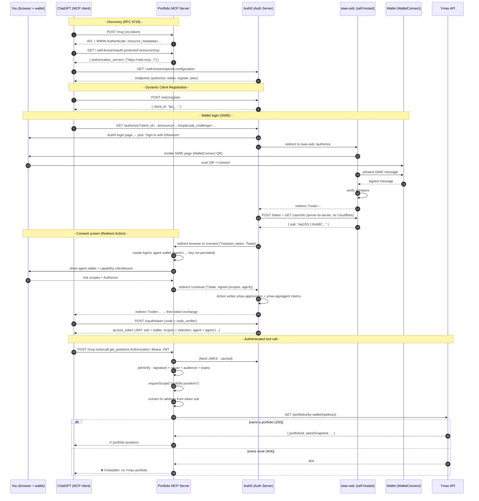

# Portfolio MCP Server - Sign-In with Ethereum (SIWE)

An [MCP](https://modelcontextprotocol.io) server that lets an AI client (ChatGPT / Claude) read a
user's **Ymax portfolio** - where the user logs in with their **Ethereum wallet**.

The whole point of this repo is the **auth**: proving that wallet login (SIWE) can be plugged into
the OAuth flow that MCP clients require, and then using the proven wallet address to authorize
access to that wallet's portfolio. The two tools (`get_positions`, `get_allocation`) are just there to have something to protect.

---

## 1. How it fits together

Four moving parts:

| Part                | Role                                                    | Where                             |
| ------------------- | ------------------------------------------------------- | --------------------------------- |
| **This MCP server** | OAuth _resource server_ - validates tokens, gates tools | this repo (`src/`)                |
| **Auth0**           | _authorization server_ - DCR, login, issues tokens      | `rabi-mcp.us.auth0.com`           |
| **siwe-oidc**       | wallet-signature → OIDC bridge, behind Auth0            | `siwe-oidc/` (self-hosted Docker) |
| **Ymax API**        | source of truth for portfolio ownership                 | `main1.ymax.app`                  |

---

## 2. Setup part A - Auth0 as the authorization server

Auth0 tenant used here: **`rabi-mcp`** (domain `rabi-mcp.us.auth0.com`).

### A.1 - Enable Dynamic Client Registration

`Settings → Advanced → "Enable Dynamic Client Registration" = Open Dynamic Registration`.

This lets ChatGPT self-register. (Open DCR = anyone can register without a token)

### A.2 - Create the API (this is the token audience)

`Applications → APIs → Create API`:

- **Name:** `my-mcp`
- **Identifier:** `https://auth0-siwe-tesj4.sevalla.app/mcp`
  _(must equal the server's public `/mcp` URL - it becomes the token's `aud` claim)_
- **Signing Algorithm:** **RS256** (the MCP server verifies against the RS256 JWKS)

### A.3 - Define the portfolio scopes

On the API's **Permissions** tab, add:

| Scope                  | Description                       |
| ---------------------- | --------------------------------- |
| `portfolio:positions`  | read portfolio positions/balances |
| `portfolio:allocation` | read portfolio target allocation  |
| `portfolio:rebalance`  | write: rebalance the portfolio    |

### A.4 - Enable RBAC

On the API's **Settings** tab, turn **both** ON:

- **Enable RBAC**
- **Add Permissions in the Access Token**

### A.5 - Authorize third-party (DCR) apps ⚠️ easy to miss

Still on the API's **Settings** tab, under **"Default Permissions for third-party applications"**:

- **User-delegated access = Authorized**
- Select the `portfolio:*` scopes.

DCR clients are **always third-party** in Auth0 - you can't grant permissions per-app, so this
tenant-level default is the _only_ thing that lets ChatGPT request the API at all. Skip it and you
get `Client is not authorized to access resource server`.

---

## 3. Setup part B - SIWE as a login method

Auth0 has a **Sign-In with Ethereum** marketplace connection (by SpruceID). Add it and promote it to domain level so every app (including DCR clients) can use it:

`Authentication → Social → add "Sign-In with Ethereum"`, then
`→ the connection → Advanced → Promote to Domain Level → SAVE`.

### Why the marketplace connection alone fails

Out of the box that connection points at SpruceID's **public** provider, `oidc.login.xyz`, which
apparently sits behind a **Cloudflare bot challenge**. A login has two kinds of calls:

- `/authorize` runs **in your browser** - the browser solves Cloudflare's JS challenge. ✅
- `/token` and `/userinfo` are **server-to-server** calls from Auth0's backend - a backend can't
  solve a JS challenge, so it gets a Cloudflare HTML page instead of JSON. ❌

Result: login gets partway, then dies at `/authorize/resume` with a generic **"Oops! something went wrong"**, and the Auth0 logs show a Cloudflare **"Just a moment…"** page on `/userinfo`.

**Fix: run your own copy of the SIWE provider** (part C), then repoint Auth0 at it (part D).

---

## 4. Setup part C - self-hosting the SIWE provider

SpruceID open-sources the provider: [`spruceid/siwe-oidc`](https://github.com/spruceid/siwe-oidc).
We run our own instance so Auth0's server-to-server calls hit a normal server (no Cloudflare).

Everything for this lives in [`siwe-oidc/`](./siwe-oidc) (Dockerfile, docker-compose, README).

---

## 5. Setup part D - point Auth0 at your instance

The Auth0 SIWE connection still targets `oidc.login.xyz`, and its dashboard form doesn't expose the endpoint URLs (they live in the connection's internal `options` + a "fetch user profile" script). So edit it via the **Auth0 Management API**.

### D.1 - Register a client on your instance

```bash
curl -X POST https://<your-siwe-url>/register \
  -H 'Content-Type: application/json' \
  -d '{"redirect_uris":["https://rabi-mcp.us.auth0.com/login/callback"]}'
# returns client_id + client_secret
```

### D.2 - Get a Management API token

`Auth0 → APIs → Auth0 Management API → API Explorer → Create & Authorize Test App → copy token`.

### D.3 - Repoint the connection

`PATCH /api/v2/connections/{connection_id}` (strategy `oauth2`), changing from `oidc.login.xyz` →
your instance:

- `options.authorizationURL` → `https://<your-siwe-url>/authorize`
- `options.tokenURL` → `https://<your-siwe-url>/token`
- the **`/userinfo` URL inside `options.scripts.fetchUserProfile`** ← the exact call that had failed
- `options.client_id` / `options.client_secret` → the pair from D.1

After this, Auth0's server-to-server calls hit your Cloudflare-free instance and login completes.

---

## 6. Setup part E - consent screen: agent wallet + capability selection

A freshly-signed-in wallet is a **brand-new user** with no permissions, so every tool would return
`Forbidden`. Rather than granting every scope wholesale, we show the user a **consent screen** right
after they sign in that (a) shows the **agent wallet** created to act on their behalf, and (b) offers
a **checkbox per capability**, granting only what they tick.

### How it works - an Auth0 Redirect Action + a consent page we host

Auth0 **Redirect with Actions** lets a Login-flow Action suspend login, bounce the user to a page we
control, and resume with data that page returns. We use it to inject the agent wallet + the user's
scope choice:

1. **Post-login** the Action (`auth0-actions/capability-consent.js`) mints a short-lived HS256 token
   (`api.redirect.encodeToken`) and redirects the browser to the MCP server's `/consent` page.
2. **`GET /consent`** (`src/consent.ts`) verifies that token, **creates an Agoric agent wallet**
   (`src/wallet.ts`, `agoric1…`) and shows its address, then renders a checkbox per scope from the
   catalog in `src/scopes.ts` (all checked by default).
3. **`POST /consent`** validates the submission, keeps only the ticked scopes that exist in the
   catalog, and redirects to `https://<tenant>/continue?state=…&session_token=…` with a signed
   return token carrying the chosen `scopes`, the `agent` wallet address, and the `state` Auth0 checks.
4. **On continue** the Action validates that return token (`api.redirect.validateToken`) and writes
   both the chosen scopes **and** the agent wallet address into custom claims.

The Action needs two **Secrets**: `CONSENT_SECRET` (a random string, HS256, **must equal the
Worker's `CONSENT_SECRET`**) and `CONSENT_URL` (`https://<worker-host>/consent`). Add the Action to
the **Login** flow. See the file header for the step-by-step.

> **Agent wallet is prototype scaffolding (PAK-550 direction).** The `agoric1…` keypair is generated
> fresh and its private key is **not persisted** (discarded after render), so today it's identity-
> display only - the agent can't sign or act. Real custody (persist + encrypt the key) and an on-chain
> delegation step are deliberately out of scope here. The address is carried through a hidden form
> field, so the `agent` claim isn't yet authoritative (a real build makes the server the source of
> truth). See PAK-550.

### Why a custom claim, not `addScope()`

Auth0 **silently ignores** `api.accessToken.addScope()` for third-party (DCR) apps - i.e. every MCP
client. (The tenant log literally says _"these scopes were ignored."_) Custom claims are **never**
filtered, so the Action writes the selected scopes into one:

```js
// auth0-actions/capability-consent.js — onContinuePostLogin (abridged)
const payload = api.redirect.validateToken({
  secret: event.secrets.CONSENT_SECRET,
  tokenParameterName: 'session_token',
});
api.accessToken.setCustomClaim('https://ymax.app/scopes', payload.scopes ?? []);
api.accessToken.setCustomClaim('https://ymax.app/agent', payload.agent); // the agent wallet
```

- The namespace **must be a valid URL** (`https://ymax.app/scopes`, `https://ymax.app/agent`). A bare `https://ymax/scopes` is silently dropped (invalid host).
- The MCP server's verifier merges the scopes claim into the token's scope list and reads the agent
  claim into `authInfo.extra.agent` (see below).
- `CONSENT_SECRET` is a **real secret** - set it with `wrangler secret put CONSENT_SECRET` (and in
  `.dev.vars` for local dev), not in `wrangler.toml`.

---

## 7. The MCP server code

### `src/auth.ts` - token verification + resource metadata

- On startup, fetches Auth0's OIDC discovery document and builds a cached remote JWKS.
- `verifyAccessToken` runs `jwtVerify` (signature + issuer + audience + expiry). On failure it
  rethrows as the SDK's `InvalidTokenError` so the client gets a **401** (not a 500) and re-auths.
- Merges **three** claim sources into one `scopes[]` list - because Auth0 delivers scopes differently depending on setup:
  - `scope` - space-delimited standard OAuth scopes
  - `permissions` - array, from Auth0 RBAC
  - `https://ymax.app/scopes` - the namespaced custom claim from the Action (reliable for DCR apps)
- Reads the `https://ymax.app/agent` claim into `authInfo.extra.agent` - the agent wallet a tool would
  use as the Agoric identity acting on the portfolio.
- Serves `/.well-known/oauth-protected-resource/mcp` (RFC 9728) naming Auth0 as the authorization
  server, and returns the `requireBearerAuth` middleware that guards `POST /mcp`.

### `src/consent.ts` + `src/scopes.ts` + `src/wallet.ts` - the consent screen (§6)

- `src/scopes.ts` - the selectable-capability catalog (single source of truth): `portfolio:positions`,
  `portfolio:allocation` (read) and `portfolio:rebalance` (write). The consent page renders it; the
  submit handler rejects anything not in it.
- `src/wallet.ts` - `createAgentWallet()` derives a fresh Agoric (`agoric1…`) address (SLIP-44 coin
  type 564) via `@scure`/`@noble`. **Prototype:** the key is not persisted (see §6 note).
- `src/consent.ts` - `GET /consent` (verify inbound token → create agent wallet → render checkboxes)
  and `POST /consent` (validate → sign a return token with the chosen scopes + agent → redirect to
  Auth0's `/continue`). Both are unauthenticated - they run mid-login, before any token exists.

### `src/create-server.ts` - the tools + authorization

- `requireScope(extra, scope)` throws `McpError` unless the token carries the scope.
- `requirePortfolio(extra)` extracts the `0x…` address from the token `sub` (regex, robust to the
  `did:pkh` / `eip155` encoding), then calls `GET https://main1.ymax.app/portfolios/by-wallet/{addr}`:
  - **200** → authorized, returns the portfolio (incl. `portfolioId`)
  - **404** → `Forbidden: this wallet has no Ymax portfolio`
  - no address → `Forbidden: no wallet identity on the token`
- Two tools, each gated by **both** a scope and portfolio ownership:

  | Tool             | Scope                  | Returns                          |
  | ---------------- | ---------------------- | -------------------------------- |
  | `get_positions`  | `portfolio:positions`  | positions, balances, total value |
  | `get_allocation` | `portfolio:allocation` | target allocation                |

  The `portfolio:rebalance` (write) scope is **selectable on the consent screen and carried in the
  token, but has no tool yet** - exercising it needs a write tool plus the agent-wallet custody +
  on-chain delegation that are out of scope here (PAK-550).

### `src/worker.ts` - the Cloudflare Workers host (Hono + `@hono/mcp`)

Wires `POST /mcp` behind the bearer-auth middleware, exposes `GET /health`, serves the
`.well-known` discovery documents, and logs every request. The MCP transport is
`@hono/mcp`'s Web-standard `StreamableHTTPTransport` (stateless, `sessionIdGenerator: undefined`,
`enableJsonResponse: true` - a single JSON reply, no long-lived SSE stream to hold a Worker open).

The token-verification core lives in `src/auth.ts` and is runtime-agnostic (`jose` = Web Crypto), so
the auth behaviour is identical to before - only the HTTP host changed. The bearer middleware
verifies the JWT, stashes the `AuthInfo` on the Hono context via `c.set('auth', …)` (which the
transport reads and threads into each tool's `extra.authInfo`), and on failure returns **401** with a
`WWW-Authenticate` header pointing at the protected-resource metadata.

`src/server.ts` remains as a local **stdio** entry (`yarn start:stdio`) for testing the tools
without the HTTP/auth layer.

---

## 8. Deploy on Cloudflare Workers

This repo (the MCP server) deploys as a Cloudflare Worker. Config lives in `wrangler.toml`
(`main: src/worker.ts`, `compatibility_flags: ["nodejs_compat"]`, and the three `vars` below).

```bash
yarn install
yarn dev                 # local: wrangler dev (workerd) on http://127.0.0.1:8787
yarn deploy              # wrangler deploy → https://auth0-siwe-mcp.<subdomain>.workers.dev
```

Because the token audience must equal the server's own public `/mcp` URL, deployment is two-step
(the same chicken-and-egg the old Sevalla setup had):

1. First `yarn deploy` to learn the worker's URL (`…workers.dev`, or a custom domain/route).
2. Set `AUTH0_AUDIENCE` and `MCP_SERVER_URL` in `wrangler.toml` to `https://<that-url>/mcp`
   (`AUTH0_AUDIENCE` **must equal the Auth0 API identifier exactly** - so update the Auth0 API
   identifier and the SIWE post-login Action's audience to match too), then `yarn deploy` again.
3. Add `https://<that-url>/mcp` wherever the old Sevalla URL was referenced in the Auth0 setup.

The three env vars are **non-secret** (issuer domain, audience, public URL - all already published in
this README) so they live in `wrangler.toml` under `vars`, not as Wrangler secrets. For local dev,
`wrangler dev` also picks up a `.env` / `.dev.vars` file if present (gitignored).

> siwe-oidc is **unchanged** - it's a Rust Docker service (part C), not a Worker, and keeps its own
> separate deployment + env. It does **not** share this app's config.

---

## 9. Environment variables

Three non-secret `vars` (in `wrangler.toml`) plus one secret:

| Var              | Value (this deployment)    | Purpose                                                  |
| ---------------- | -------------------------- | -------------------------------------------------------- |
| `AUTH0_DOMAIN`   | `rabi-mcp.us.auth0.com`    | derives issuer + OIDC discovery + JWKS                   |
| `AUTH0_AUDIENCE` | `https://<worker-url>/mcp` | expected `aud` - **must equal the Auth0 API identifier** |
| `MCP_SERVER_URL` | `https://<worker-url>/mcp` | this server's public URL; drives the PRM document        |

| Secret           | Purpose                                                                                                                                                                                                                                                 |
| ---------------- | ------------------------------------------------------------------------------------------------------------------------------------------------------------------------------------------------------------------------------------------------------- |
| `CONSENT_SECRET` | HS256 secret for the `/consent` page (§6). **Must equal the Auth0 Action's `CONSENT_SECRET`.** Set via `wrangler secret put CONSENT_SECRET`; use `.dev.vars` locally. Only needed for capability selection - the resource-server core works without it. |

`AUTH0_AUDIENCE` and `MCP_SERVER_URL` **must both point at this deployment's domain**, and
`AUTH0_AUDIENCE` must match the Auth0 API identifier exactly - otherwise every token's `aud` fails
verification (401) or discovery breaks.

The server fails fast: if any of the three are missing, `readConfig` throws on the first request (so a
missing var shows up as a 500 from the Worker, not a silent wrong-answer).

---

## 10. Sequence diagram



---

_Companion files: [`siwe-oidc/`](./siwe-oidc) (self-hosted provider - Dockerfile, docker-compose,
deploy notes)._
