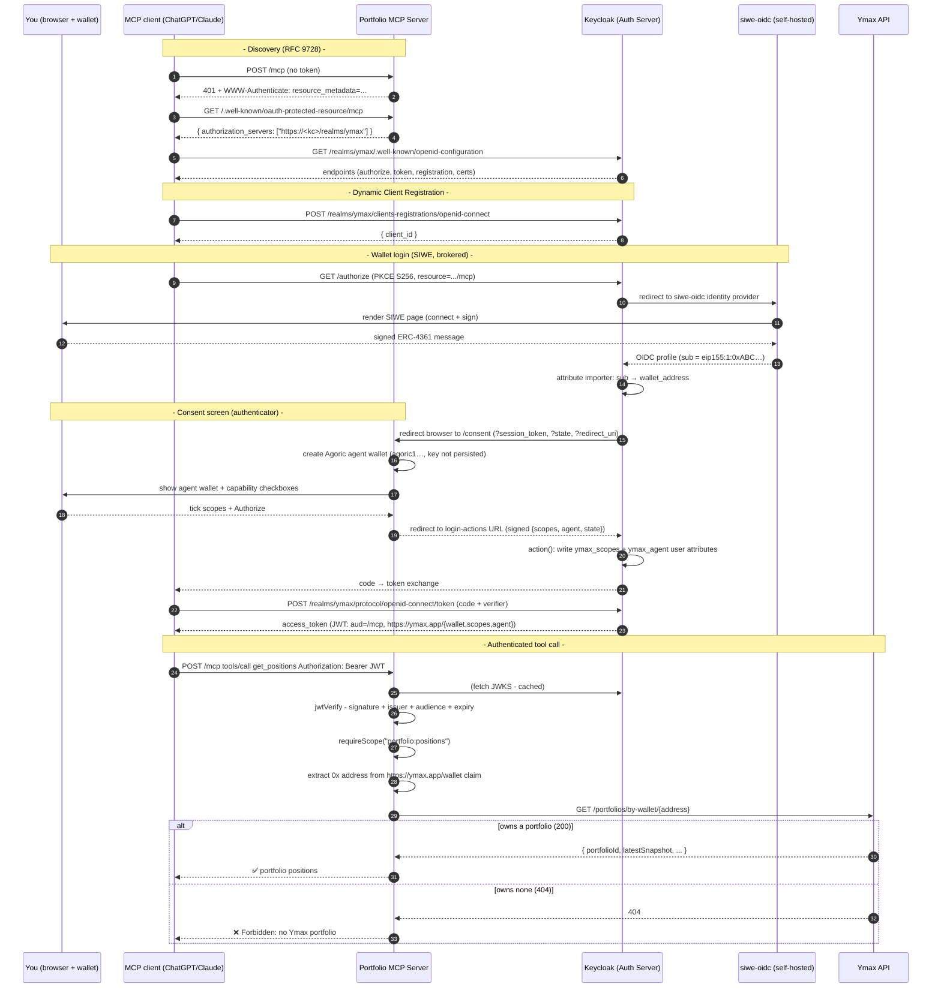

# Portfolio MCP Server - Sign-In with Ethereum (SIWE)

An [MCP](https://modelcontextprotocol.io) server that lets an AI client (ChatGPT / Claude) read a
user's **Ymax portfolio** - where the user logs in with their **Ethereum wallet**.

The whole point of this repo is the **auth**: proving that wallet login (SIWE) can be plugged into
the OAuth flow that MCP clients require, and then using the proven wallet address to authorize
access to that wallet's portfolio. The two tools (`get_positions`, `get_allocation`) are just there to have something to protect.

> **Authorization server: Keycloak (self-hosted).** This setup uses a self-hosted **Keycloak** realm
> as the OAuth authorization server. (An earlier iteration used Auth0; see the git history and
> `docs/design-authn-authz.md` for the rationale of the switch.)

---

## 1. How it fits together

Four moving parts:

| Part                | Role                                                    | Where                             |
| ------------------- | ------------------------------------------------------- | --------------------------------- |
| **This MCP server** | OAuth _resource server_ - validates tokens, gates tools | this repo (`src/`)                |
| **Keycloak**        | _authorization server_ - DCR, login, issues tokens      | self-hosted (`keycloak/`)         |
| **siwe-oidc**       | wallet-signature → OIDC bridge, brokered by Keycloak    | `siwe-oidc/` (self-hosted Docker) |
| **Ymax API**        | source of truth for portfolio ownership                 | `main1.ymax.app`                  |

Everything Keycloak-specific (docker-compose, realm export, the consent-redirect authenticator, and
the console/`kcadm` finishing steps) lives in [`keycloak/`](./keycloak) - **read
[`keycloak/README.md`](./keycloak/README.md) for the authorization-server setup**; this file focuses
on the resource server and how the pieces connect.

---

## 2. Setup part A - Keycloak as the authorization server

Keycloak runs as Docker (Keycloak + Postgres) with the realm `ymax` imported on first boot:

```bash
cd keycloak
export CONSENT_SECRET="$(openssl rand -hex 32)"   # >= 32 bytes; must equal the Worker's CONSENT_SECRET
docker compose up --build                         # → http://localhost:8080 (admin: admin/admin)
```

The realm import provisions the `siwe-oidc` identity provider and the `ymax-portfolio` client scope
(with the wallet / scopes / agent / audience mappers). A handful of steps are finished in the admin
console / `kcadm` - **all detailed in [`keycloak/README.md`](./keycloak/README.md)**:

- **Make `ymax-portfolio` a realm _default_ client scope** so DCR-registered clients inherit the
  custom claims + audience (optional scopes don't reach DCR clients).
- **Enable unmanaged user attributes** so the authenticator can write `ymax_scopes` / `ymax_agent`.
- **Relax anonymous DCR** (Trusted Hosts) so MCP clients can self-register, and raise the Max Clients
  policy from its default of 200.
- **Wire the `siwe-oidc` IdP** (endpoints + client id/secret) and **bind the consent-redirect
  authenticator** into a copied browser flow.

### Why the token `aud` needs a mapper

MCP clients send the RFC 8707 `resource` parameter, but current Keycloak (26.7.0) **ignores it**, so
tokens come out without our resource-server audience. The realm's **Audience** mapper hardcodes
`aud = https://<worker-url>/mcp` to compensate. (Native `resource` support - `RESOURCE_INDICATORS` -
is experimental-on-`main` only; once it ships the mapper can go.)

---

## 3. Setup part B - SIWE as a login method

Keycloak delegates login to a **Sign-In with Ethereum** OIDC identity provider. The user signs an
ERC-4361 message; siwe-oidc verifies the signature and returns an OIDC profile whose `sub` is the
wallet (`eip155:1:0x…`). Keycloak's **attribute importer** copies that into the `wallet_address` user
attribute, and a User Attribute mapper surfaces it in the access token as `https://ymax.app/wallet`.

> **Keycloak's `sub` is the internal user UUID**, not the wallet - so the wallet is carried in the
> `https://ymax.app/wallet` claim, and the resource server reads the address from there.

### Why self-host the SIWE provider

Out of the box the connection would point at SpruceID's **public** provider, `oidc.login.xyz`, which
sits behind a **Cloudflare bot challenge**. A login has two kinds of calls:

- `/authorize` runs **in your browser** - the browser solves Cloudflare's JS challenge. ✅
- `/token` and `/userinfo` are **server-to-server** calls from Keycloak's backend - a backend can't
  solve a JS challenge, so it gets a Cloudflare HTML page instead of JSON. ❌

**Fix: run your own copy of the SIWE provider** (part C), then point Keycloak's IdP at it (part D).

---

## 4. Setup part C - self-hosting the SIWE provider

SpruceID open-sources the provider: [`spruceid/siwe-oidc`](https://github.com/spruceid/siwe-oidc).
We run our own instance so Keycloak's server-to-server calls hit a normal server (no Cloudflare).

Everything for this lives in [`siwe-oidc/`](./siwe-oidc) (Dockerfile, docker-compose, README).

---

## 5. Setup part D - point Keycloak at your instance

Register a client on your siwe-oidc instance whose redirect URI is Keycloak's broker callback:

```bash
curl -X POST https://<your-siwe-url>/register \
  -H 'Content-Type: application/json' \
  -d '{"redirect_uris":["https://<keycloak-host>/realms/ymax/broker/siwe-oidc/endpoint"]}'
# returns client_id + client_secret
```

Then in **Identity providers → siwe-oidc**, import its `/.well-known/openid-configuration` (the
**Discovery endpoint** field) or set the endpoints manually, and set the **Client ID / Client
Secret** from the response. Details in [`keycloak/README.md`](./keycloak/README.md) §3.4.

---

## 6. Setup part E - consent screen: agent wallet + capability selection

A freshly-signed-in wallet is a **brand-new user** with no permissions, so every tool would return
`Forbidden`. Rather than granting every scope wholesale, we show the user a **consent screen** right
after they sign in that (a) shows the **agent wallet** created to act on their behalf, and (b) offers
a **checkbox per capability**, granting only what they tick.

### How it works - a Keycloak Authenticator + a consent page we host

Keycloak's **Authentication SPI** lets a custom authenticator suspend login, redirect the browser to a
page we control, and resume when it returns - the same shape as the old Auth0 Redirect Action. The
authenticator (`keycloak/authenticator/`, provider id `ymax-consent-redirect`) is bound into the
browser flow as a **Required** step after brokered SIWE login:

1. **`authenticate()`** mints a short-lived HS256 token (`sub` = wallet, `state` = a single-use nonce
   stored on the auth session) and issues a 302 to the MCP server's `/consent` page, passing the
   token, the state, and the Keycloak `login-actions` **return URL**.
2. **`GET /consent`** (`src/consent.ts`) verifies that token, validates the return URL is on the
   Keycloak origin (open-redirect guard), **creates an Agoric agent wallet** (`src/wallet.ts`,
   `agoric1…`) and shows its address, then renders a checkbox per scope from the catalog in
   `src/scopes.ts` (all checked by default).
3. **`POST /consent`** validates the submission, keeps only the ticked scopes that exist in the
   catalog, and redirects back to Keycloak's return URL with a signed token carrying the chosen
   `scopes`, the `agent` wallet address, and the `state` Keycloak checks.
4. **`action()`** validates that return token (HS256 signature + expiry + state), then writes the
   chosen scopes and agent wallet as **user attributes** (`ymax_scopes`, `ymax_agent`) and completes
   login. User Attribute mappers project those into the access token.

The authenticator needs the shared secret via a **server SPI option**
(`KC_SPI_AUTHENTICATOR_YMAX_CONSENT_REDIRECT_SECRET`, set in `keycloak/docker-compose.yml`) and the
consent-page URL via a per-execution config property. The secret **must equal the Worker's
`CONSENT_SECRET`** and be **≥ 32 bytes** (Keycloak signs with Nimbus, which rejects shorter HS256 keys).

> **Agent wallet is prototype scaffolding (PAK-550 direction).** The `agoric1…` keypair is generated
> fresh and its private key is **not persisted** (discarded after render), so today it's identity-
> display only - the agent can't sign or act. Real custody (persist + encrypt the key) and an on-chain
> delegation step are deliberately out of scope here. The address is carried through a hidden form
> field, so the `agent` claim isn't yet authoritative (a real build makes the server the source of
> truth). See PAK-550.

### Why user attributes → mappers, not the token directly

Keycloak has no Auth0-style "scopes silently dropped for third-party apps" problem: the authenticator
writes the selection onto the user, and **User Attribute protocol mappers** (on the `ymax-portfolio`
default client scope) project them into the token as namespaced claims:

- `https://ymax.app/scopes` (multivalued → JSON array), `https://ymax.app/agent`, `https://ymax.app/wallet`.
- The dots in the claim names are **escaped** in the mapper config (`https://ymax\.app/…`) because
  Keycloak treats an unescaped dot as a nested-object separator; the emitted claim string stays flat.
- The MCP server's verifier merges the scopes claim into the token's scope list, reads the agent
  claim into `authInfo.extra.agent`, and reads the wallet claim as `authInfo.extra.sub` (below).

---

## 7. The MCP server code

### `src/auth.ts` - token verification + resource metadata

- On startup, fetches Keycloak's OIDC discovery document and builds a cached remote JWKS **from the
  document's `jwks_uri`** (Keycloak serves keys at `…/protocol/openid-connect/certs`, not
  `.well-known/jwks.json` - never hardcoded).
- `makeVerifier` runs `jwtVerify` (signature + issuer + audience + expiry). On failure it rethrows as
  the SDK's `InvalidTokenError` so the client gets a **401** (not a 500) and re-auths.
- Merges **three** claim sources into one `scopes[]` list: `scope` (space-delimited), `permissions`
  (array), and `https://ymax.app/scopes` (the namespaced custom claim - the reliable carrier).
- Reads `https://ymax.app/agent` into `authInfo.extra.agent`, and `https://ymax.app/wallet` into
  `authInfo.extra.sub` (the wallet, since Keycloak's `sub` is a UUID).
- Serves `/.well-known/oauth-protected-resource/mcp` (RFC 9728) naming Keycloak as the authorization
  server, and returns the `requireBearerAuth` middleware that guards `POST /mcp`.

### `src/consent.ts` + `src/scopes.ts` + `src/wallet.ts` - the consent screen (§6)

- `src/scopes.ts` - the selectable-capability catalog (single source of truth): `portfolio:positions`,
  `portfolio:allocation` (read) and `portfolio:rebalance` (write). The consent page renders it; the
  submit handler rejects anything not in it.
- `src/wallet.ts` - `createAgentWallet()` derives a fresh Agoric (`agoric1…`) address (SLIP-44 coin
  type 564) via `@scure`/`@noble`. **Prototype:** the key is not persisted (see §6 note).
- `src/consent.ts` - `GET /consent` (verify inbound token → create agent wallet → render checkboxes)
  and `POST /consent` (validate → sign a return token with the chosen scopes + agent → redirect to
  Keycloak's `login-actions` return URL). Both are unauthenticated - they run mid-login, before any
  token exists - and both validate the return URL against the Keycloak origin.

### `src/create-server.ts` - the tools + authorization

- `requireScope(extra, scope)` throws `McpError` unless the token carries the scope.
- `requirePortfolio(extra)` extracts the `0x…` address from `authInfo.extra.sub` (the wallet claim,
  robust to the `eip155` encoding), then calls `GET https://main1.ymax.app/portfolios/by-wallet/{addr}`:
  - **200** → authorized, returns the portfolio (incl. `portfolioId`)
  - **404** → `Forbidden: this wallet has no Ymax portfolio`
  - no address → `Forbidden: no wallet identity on the token`
- Two tools, each gated by **both** a scope and portfolio ownership:

  | Tool             | Scope                  | Returns                          |
  | ---------------- | ---------------------- | -------------------------------- |
  | `get_positions`  | `portfolio:positions`  | positions, balances, total value |
  | `get_allocation` | `portfolio:allocation` | target allocation                |

  The `portfolio:rebalance` (write) scope is **selectable on the consent screen and carried in the
  token, but has no tool yet** - exercising it needs a write tool plus the agent-wallet custody +
  on-chain delegation that are out of scope here (PAK-550).

### `src/worker.ts` - the Cloudflare Workers host (Hono + `@hono/mcp`)

Wires `POST /mcp` behind the bearer-auth middleware, exposes `GET /health`, serves the `.well-known`
discovery documents, and logs every request. The MCP transport is `@hono/mcp`'s Web-standard
`StreamableHTTPTransport` (stateless, `sessionIdGenerator: undefined`, `enableJsonResponse: true`).

The token-verification core lives in `src/auth.ts` and is runtime-agnostic (`jose` = Web Crypto). The
bearer middleware verifies the JWT, stashes the `AuthInfo` on the Hono context via `c.set('auth', …)`
(which the transport threads into each tool's `extra.authInfo`), and on failure returns **401** with a
`WWW-Authenticate` header pointing at the protected-resource metadata.

`src/server.ts` remains as a local **stdio** entry (`yarn start:stdio`) for testing the tools without
the HTTP/auth layer.

---

## 8. Deploy on Cloudflare Workers

This repo (the MCP server) deploys as a Cloudflare Worker. Config lives in `wrangler.toml`
(`main: src/worker.ts`, `compatibility_flags: ["nodejs_compat"]`, and the three `vars` below).

```bash
yarn install
yarn dev                 # local: wrangler dev (workerd) on http://127.0.0.1:8787
yarn deploy              # wrangler deploy → https://auth0-siwe-mcp.<subdomain>.workers.dev
```

Because the token audience must equal the server's own public `/mcp` URL, deployment is two-step:

1. First `yarn deploy` to learn the worker's URL (`…workers.dev`, or a custom domain/route).
2. Set `KEYCLOAK_AUDIENCE` and `MCP_SERVER_URL` in `wrangler.toml` to `https://<that-url>/mcp`, and
   set the realm's **Audience mapper** `Included Custom Audience` to the same value. Then `yarn deploy`
   again.
3. Point the consent-redirect authenticator's **Consent page URL** at `https://<that-url>/consent`.

`KEYCLOAK_ISSUER` / `KEYCLOAK_AUDIENCE` / `MCP_SERVER_URL` are **non-secret** and live in
`wrangler.toml` under `vars`. `CONSENT_SECRET` is a **real secret** - set it with `wrangler secret put
CONSENT_SECRET` (and `.dev.vars` for local dev), and it must equal the value passed to Keycloak.

> siwe-oidc is **unchanged** - it's a Rust Docker service (part C), not a Worker, and keeps its own
> separate deployment + env. It does **not** share this app's config.

---

## 9. Environment variables

Three non-secret `vars` (in `wrangler.toml`) plus one secret:

| Var                 | Value (example)                 | Purpose                                                        |
| ------------------- | ------------------------------- | -------------------------------------------------------------- |
| `KEYCLOAK_ISSUER`   | `https://<kc-host>/realms/ymax` | realm issuer (**no** trailing slash); derives discovery + JWKS |
| `KEYCLOAK_AUDIENCE` | `https://<worker-url>/mcp`      | expected `aud` - **must equal the realm's Audience mapper**    |
| `MCP_SERVER_URL`    | `https://<worker-url>/mcp`      | this server's public URL; drives the PRM document              |

| Secret           | Purpose                                                                                                                                                                                                                        |
| ---------------- | ------------------------------------------------------------------------------------------------------------------------------------------------------------------------------------------------------------------------------ |
| `CONSENT_SECRET` | HS256 secret for the `/consent` page (§6). **Must equal the value passed to Keycloak** (`KC_SPI_AUTHENTICATOR_YMAX_CONSENT_REDIRECT_SECRET`) and be **≥ 32 bytes**. `wrangler secret put CONSENT_SECRET`; `.dev.vars` locally. |

`KEYCLOAK_AUDIENCE` and `MCP_SERVER_URL` **must both point at this deployment's domain**, and
`KEYCLOAK_AUDIENCE` must match the realm's Audience mapper exactly - otherwise every token's `aud`
fails verification (401). The server fails fast: if any of the three `vars` are missing, `readConfig`
throws on the first request.

---

## 10. Sequence diagram



---

_Companion files: [`keycloak/`](./keycloak) (authorization server - docker-compose, realm export, the
consent-redirect authenticator) and [`siwe-oidc/`](./siwe-oidc) (self-hosted SIWE provider)._
