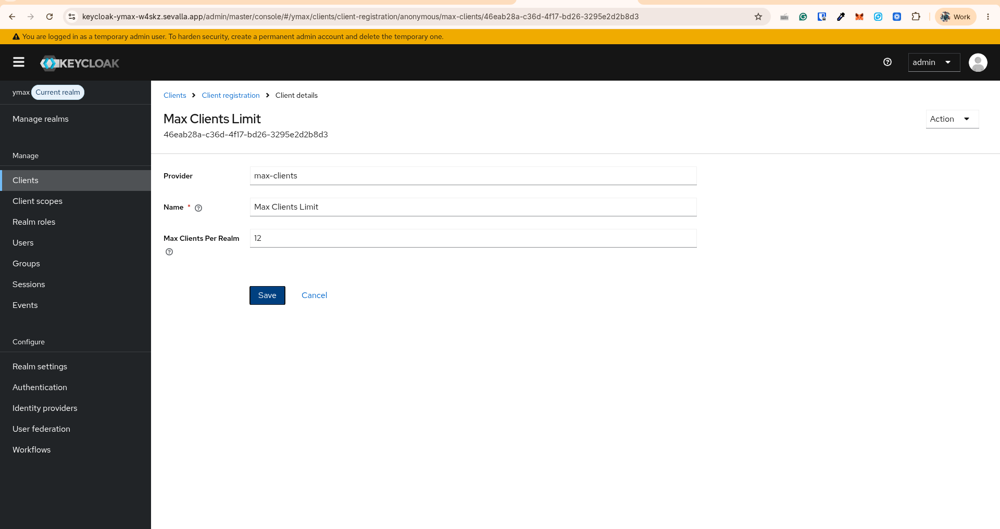

# Auth0 vs Keycloak (for this project)

This POC started on **Auth0** and moved to a self-hosted **Keycloak** realm. Both are standards-compliant
OAuth 2.1 / OpenID Connect authorization servers, and both can do everything this project needs. This page
compares them on the handful of things that actually differed for us: **dynamic client registration
limits**, **custom login logic**, and **security**.

## Summary

| Dimension                       | Auth0                                                                                                                     | Keycloak                                                                                                                               |
| ------------------------------- | ------------------------------------------------------------------------------------------------------------------------- | -------------------------------------------------------------------------------------------------------------------------------------- |
| **Dynamic client registration** | Gated + quota-limited; free tenant caps at ~10 apps, each DCR consumes the tenant's app quota                             | Enabled; default cap **200**, trivially raised or removed; bounded only by the database                                                |
| **Custom login logic**          | [Redirect Action](https://auth0.com/docs/customize/actions/flows-and-triggers/login-flow) - JavaScript in Auth0's sandbox | [Authenticator SPI](https://www.keycloak.org/docs/latest/server_development/#_auth_spi) - a Java plugin we build and ship in the image |
| **Security posture**            | Standards-compliant; Auth0 patches it                                                                                     | Standards-compliant; we patch it                                                                                                       |
| **Hosting / cost**              | Managed SaaS, per-MAU pricing                                                                                             | Self-hosted(pay only for infra)                                                                                                        |

## 1. Dynamic Client Registration (DCR)

MCP clients (ChatGPT, Claude) **self-register on every fresh connection**, so DCR volume matters more than
in a normal app.

**Auth0.** DCR is a gated feature and every registration creates a real **Application** in the tenant that
counts against the tenant's application quota. On a free/dev tenant that quota is small - we hit a ceiling
around **10** - and there's no automatic expiry, so repeated MCP connections exhaust it quickly. Raising
it means moving up paid plans.
→ [Auth0: Dynamic Client Registration](https://auth0.com/docs/get-started/applications/dynamic-client-registration)

**Keycloak.** The only limit is the **Max Clients Policy**, a client-registration policy that (per the docs) "rejects registration if the current number of clients in the realm is the same or larger than the specified limit. **It is 1000 by default in the self hosted version**". And it can be updated from the dashboard ourselves:

Either way the true ceiling is your database/infra, not a plan tier.

## 2. Custom login logic (the consent redirect)

Both let you inject custom logic mid-login; the difference is the mechanism and effort.

**Auth0.** A **Redirect Action** - JavaScript that runs in Auth0's managed sandbox. You write the function
in the dashboard, it redirects the user to an external page and resumes on return. No build step, no
deploy; Auth0 runs it for you.

**Keycloak.** The same behavior is a **custom Authenticator** written in **Java** against the Authenticator
SPI (`ymax-consent-redirect`). You implement `authenticate()` / `action()`, compile it into a provider
jar, ship it in the image, and register it with `kc.sh build`, then place it in a flow. More moving parts
than an Action - but no sandbox limits, and it's plain Java with full server APIs.

|               | Auth0 Redirect Action | Keycloak Authenticator SPI                 |
| ------------- | --------------------- | ------------------------------------------ |
| Language      | JavaScript            | Java                                       |
| Where it runs | Auth0's sandbox       | Inside your Keycloak                       |
| Ship it       | Paste in dashboard    | Build a jar, bake into the image           |
| Placed in     | Login flow trigger    | An authentication flow (here: post-broker) |

Functionally they're equivalent - both do the "redirect out to our `/consent` page, verify a signed reply,
write the selection into the token" round-trip. The Java route is more work to set up but fully unlocked.
→ [Auth0 Actions](https://auth0.com/docs/customize/actions) · [Keycloak Authenticator SPI](https://www.keycloak.org/docs/latest/server_development/#_auth_spi)

## 3. Security

Roughly **equivalent** for our purposes - this was not a deciding factor. Both are mature, audited,
standards-compliant OAuth 2.1 / OIDC servers: PKCE, discovery, JWKS/RS256 token signing, rotating keys,
DCR. Neither is meaningfully "more secure" out of the box for this design.

The one security-relevant difference is **operational, not protocol**:

- **Auth0 patches itself** - CVEs and upgrades are handled by the vendor.
- **Keycloak is our responsibility** - we rebuild the image and migrate the DB to take security updates,
  and we own hardening (admin account, network, secrets).

So: equal on the protocol/crypto surface; with Keycloak we take on the patching and hardening that Auth0
would otherwise do for us.

## Bottom line

For this project the deciding axis was **DCR economics** (unlimited, free, self-capped vs. gated and
quota-limited) plus **cost/control** (no per-MAU pricing, data in our own DB). Custom login logic and
security were close to a wash - Auth0 is less effort (JS Action, zero ops), Keycloak is more effort but
unbounded. Full rationale in [`design-authn-authz.md`](./design-authn-authz.md); setup in
[`keycloak-setup.md`](./keycloak-setup.md).
