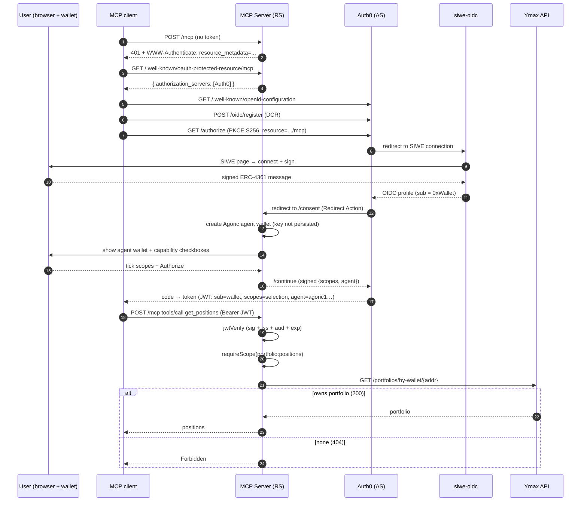

# Design: AuthN / AuthZ for MCP servers

**Status:** Draft · **Ticket:** [PAK-552](https://linear.app/agoric/issue/PAK-552) · **Parent:** [PAK-550](https://linear.app/agoric/issue/PAK-550) · **Author:** Rabi Siddique · **Last updated:** 2026-07-07

---

## 1. Overview

We need MCP servers that expose a user's Ymax portfolio to AI harnesses (ChatGPT, Codex, Claude Code) to answer two questions on every request:

- **AuthN - who is calling?** The caller must prove control of an EVM wallet.
- **AuthZ - what may they do?** The caller may only touch a portfolio that wallet owns, and only through capabilities they hold.

This document specifies that authentication + authorization layer. It is anchored on a prototype that works end-to-end (verified with ChatGPT as the client): **Sign-In with Ethereum (SIWE) plugged into Auth0 as the OAuth 2.1 authorization server, with the MCP server as a pure resource server.** The prototype lives in this repo.

**Recommendation**: Use **Auth0 + a self-hosted SIWE→OIDC service** and **fork siwe-oidc**, pending a security and maintenance review. This provides the standards-compliant OAuth support MCP clients require without building and maintaining a security-critical authorization server from scratch.

## 2. Background

### 2.1 The MCP OAuth model

MCP's authorization spec splits two roles:

- **Authorization Server (AS)** - runs login, dynamic client registration, and token issuance. Publishes `/.well-known/oauth-authorization-server` (RFC 8414) / `/.well-known/openid-configuration` endpoints.
- **Resource Server (RS)** - hosts the tools, validates bearer tokens, and advertises which AS to use via `/.well-known/oauth-protected-resource` (RFC 9728).

A first tool call with no access token gets a **401 + `WWW-Authenticate`** pointing at the RS's protected-resource metadata; the client follows that to the AS, registers, runs PKCE login, and returns with a bearer token. The RS then verifies the JWT (signature via cached JWKS, plus issuer/audience/expiry) on every call.

### 2.2 Sign-In with Ethereum (SIWE)

**Sign-In with Ethereum** ([ERC-4361](https://eips.ethereum.org/EIPS/eip-4361)) authenticates a user by having them sign a structured, human-readable message with their Ethereum wallet - no password, no email. The flow: the provider issues a one-time **nonce**; the wallet signs a message binding that nonce, the site's domain, and a timestamp; the provider verifies the signature recovers to the claimed `0x…` address. Control of the private key is the proof of identity, and enforcing the nonce as single-use is what prevents replay.

In this design SIWE is the **authentication primitive**: the proven wallet address becomes the token's `sub`, and every authorization decision (§4.2) is made against that address. SIWE was introduced by SpruceID - see [login.xyz](https://login.xyz) and its [docs](https://docs.login.xyz). We consume it through the [`siwe-oidc`](https://github.com/spruceid/siwe-oidc) provider, which wraps SIWE in an OIDC interface Auth0 can federate to (§4.1).

## 3. Paths considered

MCP requires an OAuth **authorization server** (§2); the real question is whether an approach _provides_ one or makes us _build_ one. Two approaches can realistically deliver that surface - **buy it** (Auth0) or **build it** (`siwe` + Auth.js) - and this document evaluates both.

From [kriskowal/garden's SIWE research](https://github.com/kriskowal/garden/blob/7d7fd835eab379031bfbdc37b9ca77d9729279dd/inbox/maintainer/unread/20260624T222907Z-d848e0.md), the two recommended approaches that were investigated:

| Path                                   | AS surface (DCR / discovery / token / JWKS) | Effort                          | Verdict                                                        |
| -------------------------------------- | ------------------------------------------- | ------------------------------- | -------------------------------------------------------------- |
| **A. Auth0 + self-hosted `siwe-oidc`** | Provided by Auth0                           | Wire-up + self-host SIWE bridge | **Validated end-to-end. Recommended.**                         |
| B. `siwe` + NextAuth/Auth.js           | **We build all of it**                      | Build + own a full OAuth AS     | Viable, but highest security burden; re-implements `siwe-oidc` |

**Why not B (garden's "default"):** garden recommends `siwe` + Auth.js as lowest-dependency. But Auth.js is a _relying party_, not an authorization server - it gives us session management, nothing else. To be MCP-compatible we'd have to build and then operate **discovery metadata, DCR (`/oauth/register`), the authorize endpoint with PKCE + single-use codes, the token endpoint, RS256 JWKS + key management, and a persistent client/code store**. That is exactly the security-critical surface `siwe-oidc` already ships. The tradeoff is real but inverted: path B avoids the unmaintained dependency by making us maintain a security-critical OAuth server instead - the wrong trade given the goal of minimizing the security-critical surface we own.

## 4. Recommended architecture (Path A)

Four components:

| Part                       | Role                                                           | Where                        |
| -------------------------- | -------------------------------------------------------------- | ---------------------------- |
| **MCP server** (this repo) | OAuth **resource server** - verifies tokens, gates tools       | Cloudflare Workers           |
| **Auth0**                  | **Authorization server** - DCR, login, token issuance, RBAC    | `rabi-mcp.us.auth0.com`      |
| **siwe-oidc**              | wallet-signature → OIDC bridge, behind Auth0's SIWE connection | self-hosted (Docker + Redis) |
| **Ymax API**               | source of truth for portfolio ownership                        | `main1.ymax.app`             |

### 4.1 Authentication

Auth0 delegates login to a **Sign-In with Ethereum** OIDC connection. The user signs an ERC-4361 message; the SIWE provider verifies the signature and returns an OIDC profile whose `sub` is the wallet (`eip155:1:0x…`). Auth0 consumes that `sub` and mints its own token to the MCP client.

**Why self-host the SIWE provider:** SpruceID's public instance (`oidc.login.xyz`) sits behind a Cloudflare bot challenge. `/authorize` runs in the browser (solves the JS challenge) but Auth0's server-to-server `/token` + `/userinfo` calls receive a Cloudflare HTML page instead of JSON, so login dies at `/authorize/resume`. Running our own instance removes Cloudflare from the server-to-server path. (Confirmed with SpruceID upstream.)

### 4.2 Authorization

Two independent gates, both required per tool:

1. **Scope** - the token must carry the tool's scope (i.e. `portfolio:positions`, `portfolio:allocation`; `portfolio:rebalance` for the write path).
2. **Portfolio ownership** - extract the `0x…` address from the token `sub`, then `GET https://main1.ymax.app/portfolios/by-wallet/{addr}`: **200** → authorized (returns the portfolio to scope to); **404** → `Forbidden: no Ymax portfolio`; no address → `Forbidden: no wallet identity`.

Ownership is verified against Ymax **out-of-band on every call**, not trusted from a claim - the token proves _who_, Ymax proves _what they own_.

**Scopes are user-selected on a consent screen and delivered via a custom claim:** immediately after wallet login, an Auth0 **Redirect Action** suspends the flow and sends the user to a consent page the RS hosts (`/consent`), which renders a checkbox per capability; the page returns the ticked scopes to Auth0's `/continue`, and the Action writes them into the namespaced claim `https://ymax.app/scopes` (the namespace must be a valid URL; custom claims are never filtered - unlike `addScope()`, which Auth0 silently drops for DCR apps). The RS merges **three** scope sources into one list: `scope` (space-delimited), `permissions` (RBAC array), and `https://ymax.app/scopes` (the reliable one for DCR).

> **PAK-550 scaffolding already in the prototype:** the same consent screen also creates an **agent wallet** (an Agoric `agoric1…` address) to act on the user's behalf and stamps it into a `https://ymax.app/agent` claim, and offers a `portfolio:rebalance` write scope. Today these are **identity/selection only** - the agent key is not persisted and no tool consumes the write scope. Turning them into real capability (key custody + on-chain delegation + write tools) is PAK-550 (§5).

### 4.3 Token verification (the RS security core)

`src/auth.ts`, runtime-agnostic (`jose` = Web Crypto):

- On first request per isolate: fetch Auth0's OIDC discovery doc (Auth0 uses non-standard paths like `/oauth/token`, `/oidc/register`, so we read the real document rather than synthesize), build a cached remote JWKS.
- Per request: `jwtVerify` checks **signature (RS256, against Auth0's JWKS) + issuer + audience + expiry**. Any failure is rethrown as the SDK's `InvalidTokenError` so the client gets a **401** (→ re-auth), never a 500.
- **Audience binding:** `AUTH0_AUDIENCE` must equal both the Auth0 API identifier _and_ the server's own public `/mcp` URL. This forces a two-step deploy: the first deploy reveals the worker URL, which then becomes the audience on the second.

### 4.4 End-to-end flow

## 5. Recommendation & next steps

**Adopt Path A: Auth0 as the OAuth authorization server, with a self-hosted `siwe-oidc` as the SIWE→OIDC bridge.** It avoids building and operating a security-critical OAuth authorization server ourselves (§3). Fall back to Path B only if this proves untenable.

Because upstream `siwe-oidc` is stale (v0.1.0, ~2yr) and unaudited, we **fork/vendor** it rather than depend on upstream - pinning a copy, keeping our fixes (e.g. the WalletConnect `PROJECT_ID` baked into the frontend), and commissioning a security review. This is contingent on the pending SpruceID maintenance answer, which could still flip the call to _keep_ (depend on upstream) or _replace_ (build the bridge ourselves); current signals point to fork.

> **The audit gap is path-independent.** By SpruceID's own disclaimers, neither `siwe-oidc` nor the underlying SIWE reference libraries (the Rust `siwe` crate _and_ the TypeScript [`siwe`](https://github.com/spruceid/siwe) library) have had a formal security audit. So rebuilding the bridge ourselves in TS (the _replace_ option) is safer on **maintenance**, not on **audit** - it inherits the same unaudited SIWE-verification core. A security review of the SIWE-verification path (signature + nonce/domain/timestamp validation) is required **whichever** option we choose. This is also an argument to keep the SIWE surface we own as small as possible and lean on Auth0 (an audited, commercial AS) for everything else.

**Blockers before any non-prototype use:**

1. **DCR sprawl (availability).** Each user/reconnect mints a new Auth0 client that is never garbage-collected, so the per-tenant client cap eventually locks out new users. Move to authenticated DCR and/or client expiry.
2. **SIWE-verification security review.** Review the SIWE-verification path (in the forked `siwe-oidc`, or our own bridge) - unaudited in every option, so this is required regardless of keep/fork/replace.

**Follow-on:**

3. Close the SpruceID verification and record the keep/fork/replace decision.
4. Hand this authN/authZ foundation to **PAK-550** for the delegation / write / multi-agent design.

## 6. References

- [PAK-552](https://linear.app/agoric/issue/PAK-552)
- Prototype: this repo (`src/auth.ts`, `src/create-server.ts`, `src/worker.ts`); companion `siwe-oidc/`
- [garden SIWE research](https://github.com/kriskowal/garden/blob/7d7fd835eab379031bfbdc37b9ca77d9729279dd/inbox/maintainer/unread/20260624T222907Z-d848e0.md)
- MCP authorization: [tutorial](https://modelcontextprotocol.io/docs/tutorials/security/authorization) · [spec](https://modelcontextprotocol.io/specification/latest/basic/authorization) · [security best practices](https://modelcontextprotocol.io/specification/draft/basic/security_best_practices)
- SIWE: [ERC-4361](https://eips.ethereum.org/EIPS/eip-4361) · [login.xyz docs](https://docs.login.xyz)
- [spruceid/siwe-oidc](https://github.com/spruceid/siwe-oidc) · [Agoric/capsule-sdk](https://github.com/Agoric/capsule-sdk)
- RFCs: [9728](https://datatracker.ietf.org/doc/html/rfc9728) (protected-resource metadata), [8414](https://datatracker.ietf.org/doc/html/rfc8414) (AS metadata), [7591](https://datatracker.ietf.org/doc/html/rfc7591) (DCR), [8707](https://datatracker.ietf.org/doc/html/rfc8707) (resource indicators), [7517](https://datatracker.ietf.org/doc/html/rfc7517) (JWKS); [ERC-4361](https://eips.ethereum.org/EIPS/eip-4361) (SIWE)
