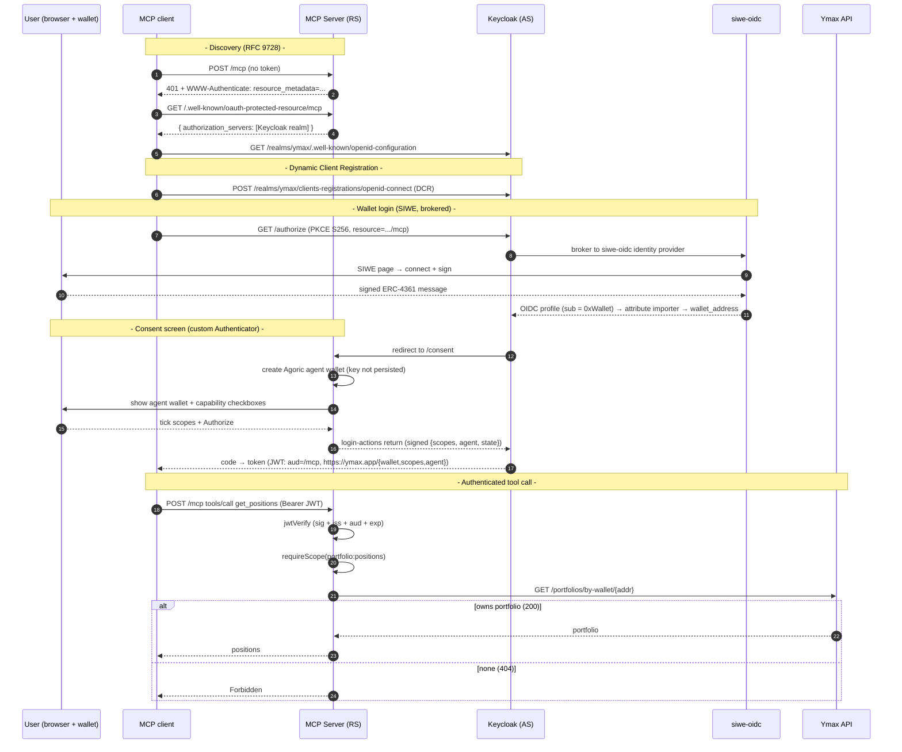

# Design: AuthN / AuthZ for MCP servers

**Ticket:** [PAK-552](https://linear.app/agoric/issue/PAK-552) · **Parent:** [PAK-550](https://linear.app/agoric/issue/PAK-550) · **Author:** Rabi Siddique

> **History.** An earlier version of this design used **Auth0** as the hosted authorization server.
> This POC now uses a **self-hosted Keycloak** realm instead — an open-source authorization server we
> run ourselves — keeping the same overall shape (SIWE brokered in, MCP server as a pure resource
> server) while removing the dependency on a commercial hosted AS. §3 and §5 record the trade.

---

## 1. Overview

We need MCP servers that expose a user's Ymax portfolio to AI harnesses (ChatGPT, Codex, Claude Code) to answer two questions on every request:

- **AuthN - who is calling?** The caller must prove control of an EVM wallet.
- **AuthZ - what may they do?** The caller may only touch a portfolio that wallet owns, and only through capabilities they hold.

This document specifies that authentication + authorization layer. It is anchored on a prototype that works end-to-end: **Sign-In with Ethereum (SIWE) brokered into a standards-compliant OAuth 2.1 authorization server, with the MCP server as a pure resource server.** The prototype lives in this repo.

**Recommendation**: Use a **self-hosted Keycloak** realm as the authorization server, with a
**self-hosted SIWE→OIDC service** (`siwe-oidc`) brokered in as an OIDC identity provider. This
provides the standards-compliant OAuth surface MCP clients require (DCR, discovery, PKCE, RS256 JWKS)
from a mature, audited open-source product — without building and maintaining a security-critical
authorization server from scratch, and without a per-tenant dependency on a commercial host.

## 2. Background

### 2.1 The MCP OAuth model

MCP's authorization spec splits two roles:

- **Authorization Server (AS)** - runs login, dynamic client registration, and token issuance. Publishes `/.well-known/oauth-authorization-server` (RFC 8414) / `/.well-known/openid-configuration` endpoints.
- **Resource Server (RS)** - hosts the tools, validates bearer tokens, and advertises which AS to use via `/.well-known/oauth-protected-resource` (RFC 9728).

A first tool call with no access token gets a **401 + `WWW-Authenticate`** pointing at the RS's protected-resource metadata; the client follows that to the AS, registers, runs PKCE login, and returns with a bearer token. The RS then verifies the JWT (signature via cached JWKS, plus issuer/audience/expiry) on every call.

### 2.2 Sign-In with Ethereum (SIWE)

**Sign-In with Ethereum** ([ERC-4361](https://eips.ethereum.org/EIPS/eip-4361)) authenticates a user by having them sign a structured, human-readable message with their Ethereum wallet - no password, no email. The flow: the provider issues a one-time **nonce**; the wallet signs a message binding that nonce, the site's domain, and a timestamp; the provider verifies the signature recovers to the claimed `0x…` address. Control of the private key is the proof of identity, and enforcing the nonce as single-use is what prevents replay.

In this design SIWE is the **authentication primitive**: the proven wallet address becomes the identity every authorization decision (§4.2) is made against. SIWE was introduced by SpruceID - see [login.xyz](https://login.xyz) and its [docs](https://docs.login.xyz). We consume it through the [`siwe-oidc`](https://github.com/spruceid/siwe-oidc) provider, which wraps SIWE in an OIDC interface Keycloak can broker to (§4.1).

## 3. Paths considered

MCP requires an OAuth **authorization server** (§2); the real question is whether an approach _provides_ one or makes us _build_ one. Three approaches can realistically deliver that surface — **buy it** (Auth0), **self-host it** (Keycloak), or **build it** (`siwe` + Auth.js).

| Path                                      | AS surface (DCR / discovery / token / JWKS) | Effort                                | Verdict                                                                                     |
| ----------------------------------------- | ------------------------------------------- | ------------------------------------- | ------------------------------------------------------------------------------------------- |
| **A. Keycloak + self-hosted `siwe-oidc`** | Provided by Keycloak (OSS)                  | Wire-up + self-host Keycloak & bridge | **Current choice.** Standards-compliant AS we run; no host lock-in.                         |
| B. Auth0 + self-hosted `siwe-oidc`        | Provided by Auth0 (hosted)                  | Wire-up + self-host SIWE bridge       | Validated earlier; works, but a commercial hosted dependency with per-tenant entity limits. |
| C. `siwe` + NextAuth/Auth.js              | **We build all of it**                      | Build + own a full OAuth AS           | Viable, but highest security burden; re-implements `siwe-oidc`.                             |

**Why A over B (Keycloak over Auth0):** both give a compliant AS without us building one. Keycloak is
open-source and self-hosted, so there's no commercial-tenant dependency and no per-tenant application
cap (Auth0 caps applications per tenant; each DCR client consumes one — see §6). The cost is that we
operate Keycloak (a container + Postgres) and own its upgrades/patching. For a wallet-native product
where each user/reconnect mints a DCR client, removing the hosted per-tenant ceiling and keeping the
whole login stack self-hosted is the better fit. Keycloak also brokers OIDC identity providers and
extends cleanly via the Authentication SPI (which is how the consent screen is implemented, §4.2).

**Why not C (garden's "default"):** [garden's SIWE research](https://github.com/kriskowal/garden/blob/7d7fd835eab379031bfbdc37b9ca77d9729279dd/inbox/maintainer/unread/20260624T222907Z-d848e0.md) recommends `siwe` + Auth.js as lowest-dependency. But Auth.js is a _relying party_, not an authorization server. To be MCP-compatible we'd have to build and operate **discovery metadata, DCR, the authorize endpoint with PKCE + single-use codes, the token endpoint, RS256 JWKS + key rotation, and a persistent client/code store** — exactly the security-critical surface Keycloak (and `siwe-oidc`) already ship. Path C avoids an external dependency by making us maintain a security-critical OAuth server instead — the wrong trade given the goal of minimizing the security-critical surface we own.

## 4. Recommended architecture (Path A)

Four components:

| Part                       | Role                                                           | Where                           |
| -------------------------- | -------------------------------------------------------------- | ------------------------------- |
| **MCP server** (this repo) | OAuth **resource server** - verifies tokens, gates tools       | Cloudflare Workers              |
| **Keycloak**               | **Authorization server** - DCR, login, token issuance, mappers | self-hosted (Docker + Postgres) |
| **siwe-oidc**              | wallet-signature → OIDC bridge, brokered by Keycloak           | self-hosted (Docker + Redis)    |
| **Ymax API**               | source of truth for portfolio ownership                        | `main1.ymax.app`                |

### 4.1 Authentication

Keycloak delegates login to a **Sign-In with Ethereum** OIDC **identity provider** (`siwe-oidc`). The user signs an ERC-4361 message; siwe-oidc verifies the signature and returns an OIDC profile whose `sub` is the wallet (`eip155:1:0x…`). An IdP **attribute importer** copies that wallet into the `wallet_address` user attribute; Keycloak then mints its own token to the MCP client.

Note **Keycloak's token `sub` is the internal user UUID**, not the wallet — so the wallet is carried into the access token via a User Attribute mapper as the `https://ymax.app/wallet` claim, and the RS reads the address from there (§4.3).

**Why self-host the SIWE provider:** SpruceID's public instance (`oidc.login.xyz`) sits behind a Cloudflare bot challenge. `/authorize` runs in the browser (solves the JS challenge) but the AS's server-to-server `/token` + `/userinfo` calls receive a Cloudflare HTML page instead of JSON, so login dies at `/authorize/resume`. Running our own instance removes Cloudflare from the server-to-server path. (Confirmed with SpruceID upstream.)

### 4.2 Authorization

Two independent gates, both required per tool:

1. **Scope** - the token must carry the tool's scope (`portfolio:positions`, `portfolio:allocation`; `portfolio:rebalance` for the write path).
2. **Portfolio ownership** - extract the `0x…` address from the `https://ymax.app/wallet` claim, then `GET https://main1.ymax.app/portfolios/by-wallet/{addr}`: **200** → authorized (returns the portfolio to scope to); **404** → `Forbidden: no Ymax portfolio`; no address → `Forbidden: no wallet identity`.

Ownership is verified against Ymax **out-of-band on every call**, not trusted from a claim - the token proves _who_, Ymax proves _what they own_.

**Scopes are user-selected on a consent screen and delivered via a custom claim:** immediately after wallet login, a Keycloak **custom Authenticator** (bound into the browser flow via the Authentication SPI) suspends the flow and redirects the user to a consent page the RS hosts (`/consent`), which renders a checkbox per capability. The page returns the ticked scopes to Keycloak's `login-actions` URL; the authenticator writes them as user attributes, and **User Attribute protocol mappers** (on a default client scope) project them into the namespaced claims `https://ymax.app/scopes` and `https://ymax.app/agent`. This is the Keycloak counterpart of the Auth0 Redirect Action the earlier design used.

### 4.3 Token verification (the RS security core)

`src/auth.ts`, runtime-agnostic (`jose` = Web Crypto):

- On first request per isolate: fetch Keycloak's OIDC discovery doc (`<issuer>/.well-known/openid-configuration`) and build a cached remote JWKS **from the document's `jwks_uri`** (Keycloak serves keys at `…/protocol/openid-connect/certs`, not `.well-known/jwks.json`).
- Per request: `jwtVerify` checks **signature (RS256, against Keycloak's JWKS) + issuer + audience + expiry**. Any failure is rethrown as the SDK's `InvalidTokenError` so the client gets a **401** (→ re-auth), never a 500.
- **Issuer:** the realm issuer `https://<host>/realms/ymax` (no trailing slash) — matched exactly against the token `iss`.
- **Audience binding:** MCP clients send the RFC 8707 `resource` parameter, but current Keycloak (26.7.0) **ignores it**, so a realm **Audience mapper** hardcodes `aud = <mcp>/mcp`. `KEYCLOAK_AUDIENCE` must equal both that mapper value and the server's own public `/mcp` URL — forcing a two-step deploy (the first deploy reveals the worker URL, which then becomes the audience on the second). Native `resource` support (`RESOURCE_INDICATORS`) is experimental-on-`main` only; once it ships the mapper can be dropped.

### 4.4 End-to-end flow

## 5. Why Keycloak

The architecture above (§4) leans on Keycloak for the entire OAuth authorization-server role. This is deliberate: MCP requires a standards-compliant OAuth 2.1 **authorization server** (§2.1), and Keycloak already provides that securely as a mature, widely-deployed open-source product. Letting Keycloak own the OAuth layer frees us to spend our effort on the parts that are actually ours - wallet authentication (SIWE) and portfolio authorization - instead of building, securing, and maintaining security-critical OAuth infrastructure.

What Keycloak gives us, so we don't have to build and own it:

- **Dynamic Client Registration (DCR)** - MCP clients register themselves at `/realms/<realm>/clients-registrations/openid-connect`, gated by client-registration policies.
- **The OAuth 2.1 Authorization Code + PKCE flow.**
- **OIDC / OAuth discovery endpoints.**
- **Access-token issuance and RS256 JWT signing, JWKS publishing and signing-key rotation.**
- **OIDC identity brokering** (how `siwe-oidc` plugs in) and a **protocol-mapper** system for shaping token claims.
- **An Authentication SPI** to extend the login flow — how the consent screen (§4.2) is implemented.

Versus Auth0 (Path B), Keycloak trades a commercial hosted dependency (with per-tenant entity limits, §6) for operational ownership of a container + Postgres. Versus building our own (Path C), it avoids owning a security-critical OAuth implementation entirely.

## 6. DCR at scale — Keycloak client-registration policies

A few operational limits shape how DCR behaves.

**Anonymous DCR is off by default.** Keycloak's **Trusted Hosts** client-registration policy rejects anonymous registration unless the requesting host (and, by default, the client's URIs) match a whitelist. MCP clients register from unpredictable IPs/callback URIs, so enabling zero-config self-registration means either relaxing that policy (this POC does — mirroring Auth0's "open DCR", at the cost of weaker SSRF protection) or issuing **Initial Access Tokens** (more secure, but not zero-config). Production should prefer the latter.

**Max Clients policy.** Anonymous registration is capped by the **Max Clients** policy (default **200**) — raise it for MCP fan-out.

**No per-tenant application cap.** Unlike Auth0 (which caps applications per tenant — the earlier design tracked a 100,000-app ceiling), self-hosted Keycloak has no fixed cap beyond the Max Clients policy and the backing database. This is the main reason DCR-at-scale is less of a standing concern here.

**DCR client hygiene still applies.** Each user/reconnect mints a fresh DCR client, and clients aren't garbage-collected on their own. Prune inactive clients on a schedule (via the Admin API) and/or move to authenticated DCR before real scale.

## 7. Recommendation & next steps

**Adopt Path A: self-hosted Keycloak as the OAuth authorization server, with a self-hosted `siwe-oidc` brokered in as the SIWE→OIDC identity provider.** It provides the standards-compliant OAuth surface MCP needs from an open-source product we run ourselves, avoiding both a commercial hosted dependency (Path B) and building our own security-critical AS (Path C).

Because upstream `siwe-oidc` is stale (v0.1.0, ~2yr) and unaudited, we **fork/vendor** it rather than depend on upstream - pinning a copy, keeping our fixes (e.g. the WalletConnect `PROJECT_ID` baked into the frontend), and commissioning a security review.

> **The audit gap is path-independent.** By SpruceID's own disclaimers, neither `siwe-oidc` nor the underlying SIWE reference libraries (the Rust `siwe` crate _and_ the TypeScript [`siwe`](https://github.com/spruceid/siwe) library) have had a formal security audit. A security review of the SIWE-verification path (signature + nonce/domain/timestamp validation) is required **whichever** bridge option we choose. This is also an argument to keep the SIWE surface we own as small as possible and lean on Keycloak (a mature, widely-audited AS) for everything else.

**Follow-ups:**

1. **SIWE-verification security review.** Review the SIWE-verification path (in the forked `siwe-oidc`, or our own bridge) - unaudited in every option.
2. **DCR client hygiene + registration policy (availability at scale).** This POC relaxes the Trusted Hosts policy for open DCR; before real scale, move to **Initial Access Tokens** (or authenticated DCR) and prune inactive clients on a schedule. Raise the Max Clients policy (§6).
3. **Operate Keycloak.** Own the Keycloak + Postgres deployment: upgrades, patching, backups, HA, and a hardened production config (real TLS/hostname, `kc.sh build --optimized`, external secret for the consent SPI). Harden the consent-redirect authenticator (consider the action-token pattern for cookie-independence).
4. **Register the agent on-chain (make the `agent` claim authoritative).** To let the agent act on the portfolio, the user must **sign a transaction registering the agent with the Ymax portfolio contract** (the on-chain delegation), and the RS must persist and custody the agent key - turning `https://ymax.app/agent` (§4.2) into a real capability rather than a display value.
5. **Multi-agent: access-token handling.** Explore the path where one user runs **more than one agent** (e.g. one per harness, or one per task). Open questions: one token carrying a single `agent` claim per login (N agents ⇒ N logins/tokens), or one token enumerating multiple agents? How does the RS map an incoming token to the correct on-chain agent identity, and how are per-agent scopes, registration, and revocation handled independently? (The consent screen is the natural place to **fetch a user's existing agents and authorize per-agent** — the `/consent` plumbing already supports carrying that richer selection.)
6. Hand this authN/authZ foundation to **PAK-550** for the delegation / write / multi-agent design.

## 8. References

- [PAK-552](https://linear.app/agoric/issue/PAK-552)
- Prototype: this repo (`src/auth.ts`, `src/create-server.ts`, `src/worker.ts`, `src/consent.ts`); companions `keycloak/` (AS + consent authenticator) and `siwe-oidc/`
- [garden SIWE research](https://github.com/kriskowal/garden/blob/7d7fd835eab379031bfbdc37b9ca77d9729279dd/inbox/maintainer/unread/20260624T222907Z-d848e0.md)
- Keycloak: [Server Admin Guide](https://www.keycloak.org/docs/latest/server_admin/) · [Server Developer Guide (SPIs)](https://www.keycloak.org/docs/latest/server_development/) · [Client registration](https://www.keycloak.org/securing-apps/client-registration) · [MCP authorization server guide](https://www.keycloak.org/securing-apps/mcp-authz-server)
- MCP authorization: [tutorial](https://modelcontextprotocol.io/docs/tutorials/security/authorization) · [spec](https://modelcontextprotocol.io/specification/latest/basic/authorization) · [security best practices](https://modelcontextprotocol.io/specification/draft/basic/security_best_practices)
- SIWE: [ERC-4361](https://eips.ethereum.org/EIPS/eip-4361) · [login.xyz docs](https://docs.login.xyz)
- [spruceid/siwe-oidc](https://github.com/spruceid/siwe-oidc) · [Agoric/capsule-sdk](https://github.com/Agoric/capsule-sdk)
- RFCs: [9728](https://datatracker.ietf.org/doc/html/rfc9728) (protected-resource metadata), [8414](https://datatracker.ietf.org/doc/html/rfc8414) (AS metadata), [7591](https://datatracker.ietf.org/doc/html/rfc7591) (DCR), [8707](https://datatracker.ietf.org/doc/html/rfc8707) (resource indicators), [7517](https://datatracker.ietf.org/doc/html/rfc7517) (JWKS); [ERC-4361](https://eips.ethereum.org/EIPS/eip-4361) (SIWE)
