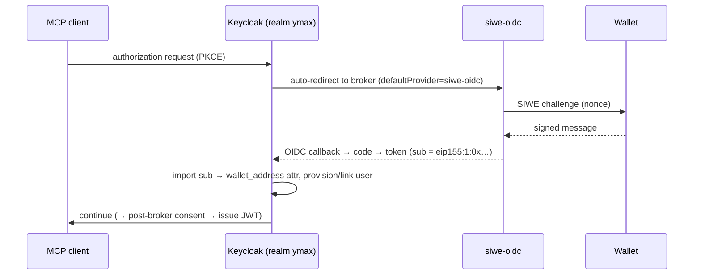

# Setup guide — SIWE + Keycloak auth for the MCP server

A step-by-step runbook for standing up the whole authentication/authorization stack from scratch:
a self-hosted **Keycloak** realm as the OAuth authorization server, **Sign-In with Ethereum** brokered
in for wallet login, and the **MCP server** as a pure OAuth resource server. For the design rationale
behind these choices, see [`design-authn-authz.md`](./design-authn-authz.md).

## What you end up with

```
MCP client ─DCR+PKCE─▶ Keycloak (realm: ymax) ─broker─▶ siwe-oidc ─▶ wallet signature
                          │  post-broker consent step ─▶ MCP /consent page
                          └─ issues JWT: aud=<mcp>/mcp, https://ymax.app/{wallet,scopes,agent}
                                            ▲
MCP client ──tool call w/ Bearer JWT──▶ MCP server (resource server): verify JWKS+iss+aud+exp
```

| Piece                 | Role                              | Example URL                                     |
| --------------------- | --------------------------------- | ----------------------------------------------- |
| `siwe-oidc`           | Wallet login (SIWE→OIDC provider) | `https://siwe-oidc-<id>.sevalla.app`            |
| Keycloak realm `ymax` | Authorization server              | `https://keycloak-<id>.sevalla.app/realms/ymax` |
| MCP server (Worker)   | Resource server                   | `https://<worker>.workers.dev/mcp`              |

## Prerequisites

- A [Sevalla](https://sevalla.com) account (hosts siwe-oidc + Keycloak + Postgres).
- A Cloudflare account (hosts the MCP Worker).
- CLIs: `sevalla` (`npm i -g @sevalla/cli`, then `sevalla login`), `wrangler`, `curl`, `python3`.
- This repo, pushed to a Git remote Sevalla can build from.
- A shared **consent secret** (≥32 bytes), used by both Keycloak and the Worker:
  ```bash
  openssl rand -hex 32   # save this; you'll set it in two places
  ```

---

## Step 1 — Deploy `siwe-oidc` (wallet login)

`siwe-oidc` turns a wallet signature into an OIDC login. Deploy it first (Keycloak brokers to it).

1. Deploy the `siwe-oidc` service (see `siwe-oidc/README.md`) to a public HTTPS URL — e.g. on Sevalla.
2. Confirm its discovery doc responds:
   ```bash
   curl -s https://siwe-oidc-<id>.sevalla.app/.well-known/openid-configuration | jq .issuer
   ```
   Note the base URL — Keycloak's IdP will point at `/authorize`, `/token`, `/userinfo`, `/jwk`.

> You register a _client_ on siwe-oidc later (Step 4.3), once you know Keycloak's broker callback URL.

---

## Step 2 — Deploy the MCP server (resource server)

The Worker validates JWTs and gates the tools. Deploy it early so you know its `/mcp` URL (needed for
Keycloak's audience mapper and the consent page URL).

1. In `wrangler.toml`, the resource-server vars (issuer is filled in Step 5):
   ```toml
   [vars]
   KEYCLOAK_ISSUER   = "https://REPLACE-keycloak-host/realms/ymax"
   KEYCLOAK_AUDIENCE = "https://<worker>.workers.dev/mcp"   # must equal the audience mapper
   MCP_SERVER_URL    = "https://<worker>.workers.dev/mcp"
   ```
2. Deploy: `yarn deploy`. Note the resulting `https://<worker>.workers.dev` URL.
3. The MCP endpoint is `…/mcp`; the consent page is `…/consent`.

---

## Step 3 — Deploy Keycloak on Sevalla

The image (`keycloak/Dockerfile`) bakes the consent authenticator + realm export and boots
`start --optimized --import-realm`. Sevalla builds it from Git.

### 3.1 Create the Postgres database

```bash
sevalla databases create --name keycloak-db --type postgresql --db-version 16 \
  --cluster <cluster-id> --resource-type <db1-id> \
  --db-name keycloak --db-user keycloak --db-password <generated>
```

Note the internal hostname from `sevalla databases get <db-id>` (e.g.
`keycloak-db-xxxx-postgresql.keycloak-db-xxxx.svc.cluster.local:5432`).

### 3.2 Create the application (Dockerfile build)

Create the app, then set the build config (the create call rejects build fields, so set them via update):

```bash
sevalla apps create --name keycloak-ymax --source privateGit --cluster <cluster-id> \
  --data '{"display_name":"keycloak-ymax","cluster_id":"<cluster-id>","source":"privateGit",
           "git_type":"github","repo_url":"https://github.com/<you>/<repo>","default_branch":"main"}'

sevalla apps update <app-id> \
  --data '{"build_type":"dockerfile","dockerfile_path":"keycloak/Dockerfile","docker_context":"keycloak"}'
```

Ensure the web process listens on **8080** (default) with ingress enabled.

### 3.3 Link the app to the database (required!)

Sevalla gates app→DB traffic behind an explicit internal connection. Without it the DB connection
hangs and resets. The CLI flag for this is broken, so use the API:

```bash
TOKEN=$(python3 -c "import json;print(json.load(open('$HOME/.config/sevalla/credentials.json'))['token'])")
curl -s -X POST "https://api.sevalla.com/v3/databases/<db-id>/internal-connections" \
  -H "Authorization: Bearer $TOKEN" -H "Content-Type: application/json" \
  -d '{"target_id":"<app-id>","target_type":"app"}'
```

### 3.4 Set environment variables

```bash
sevalla apps env-vars create <app-id> --key KC_DB_URL \
  --value "jdbc:postgresql://<db-internal-host>:5432/keycloak?sslmode=disable"   # sslmode=disable is required
sevalla apps env-vars create <app-id> --key KC_DB_USERNAME --value keycloak
sevalla apps env-vars create <app-id> --key KC_DB_PASSWORD --value <db-password>
sevalla apps env-vars create <app-id> --key KC_PROXY_HEADERS --value xforwarded  # Sevalla terminates TLS
sevalla apps env-vars create <app-id> --key KC_HTTP_ENABLED --value true
sevalla apps env-vars create <app-id> --key KC_BOOTSTRAP_ADMIN_USERNAME --value admin
sevalla apps env-vars create <app-id> --key KC_BOOTSTRAP_ADMIN_PASSWORD --value <admin-password>
sevalla apps env-vars create <app-id> --key KC_SPI_AUTHENTICATOR_YMAX_CONSENT_REDIRECT_SECRET \
  --value <the shared consent secret from Prerequisites>
```

### 3.5 Deploy, then set the hostname

```bash
sevalla apps deployments trigger <app-id> --branch main
```

Copy the app's public URL, then set `KC_HOSTNAME=https://<keycloak-host>` and redeploy. A wrong/unset
`KC_HOSTNAME` is the #1 boot failure and makes the token `iss` mismatch the Worker.

Verify Keycloak is up:

```bash
curl -s https://<keycloak-host>/realms/ymax/.well-known/openid-configuration | jq .issuer
```

> **What the realm import already gives you** (`keycloak/realm-export.json`, first boot only): the
> `ymax` realm, the `siwe-oidc` IdP (endpoints pre-filled, client creds blank), its `sub → wallet_address`
> attribute importer, and the `ymax-portfolio` client scope with all four mappers (wallet, scopes,
> agent, audience — the audience value baked to the Worker `/mcp` URL). Steps 4–5 finish what the export
> can't declare.

---

## Step 4 — Configure the realm

These are applied against the running realm. Get an admin token once and reuse it:

```bash
KC=https://<keycloak-host>
tok() { curl -s -X POST "$KC/realms/master/protocol/openid-connect/token" \
  -d grant_type=password -d client_id=admin-cli -d username=admin -d password=<admin-pw> \
  | python3 -c "import sys,json;print(json.load(sys.stdin)['access_token'])"; }
T=$(tok); H=(-H "Authorization: Bearer $T" -H "Content-Type: application/json")
```

### 4.1 Make `ymax-portfolio` a realm **default** client scope

So DCR-registered clients inherit the custom claims + audience automatically:

```bash
CSID=$(curl -s "${H[@]}" "$KC/admin/realms/ymax/client-scopes" \
  | python3 -c "import sys,json;print([c['id'] for c in json.load(sys.stdin) if c['name']=='ymax-portfolio'][0])")
curl -s -X PUT "${H[@]}" "$KC/admin/realms/ymax/default-default-client-scopes/$CSID"
```

### 4.2 Enable unmanaged user attributes

The consent authenticator writes `ymax_scopes`/`ymax_agent`; strict user-profile handling rejects
undeclared attributes otherwise:

```bash
curl -s "${H[@]}" "$KC/admin/realms/ymax/users/profile" > /tmp/up.json
python3 -c "import json;c=json.load(open('/tmp/up.json'));c['unmanagedAttributePolicy']='ENABLED';json.dump(c,open('/tmp/up2.json','w'))"
curl -s -X PUT "${H[@]}" "$KC/admin/realms/ymax/users/profile" -d @/tmp/up2.json
```

### 4.3 Register the siwe-oidc client and wire the IdP

How SIWE brokers through Keycloak at login time:



The wiring that makes the above work:

- **Identity Provider** (alias `siwe-oidc`, OIDC) points at siwe-oidc's `/authorize`, `/token`,
  `/userinfo`, `/jwk` + issuer (shipped pre-filled in `realm-export.json`).
- **Attribute importer**: incoming `sub` (the `eip155:1:0x…` wallet) → `wallet_address` user attribute
  (Keycloak's own `sub` is a generated UUID, so the wallet must ride in an attribute/claim).
- **Client credentials**: register a client on siwe-oidc with Keycloak's broker callback, then set the
  returned `client_id`/`client_secret` on the IdP (below).
- **Auto-redirect** to the wallet is configured in §4.7 (Identity Provider Redirector → `siwe-oidc`).

Register a client on siwe-oidc with Keycloak's broker callback, then paste the creds into the IdP:

```bash
curl -s -X POST https://siwe-oidc-<id>.sevalla.app/register -H 'Content-Type: application/json' \
  -d "{\"redirect_uris\":[\"$KC/realms/ymax/broker/siwe-oidc/endpoint\"]}"
# → returns client_id / client_secret
```

Then set them on the IdP (Identity providers → siwe-oidc, or via API: PUT
`/admin/realms/ymax/identity-provider/instances/siwe-oidc` with `config.clientId` / `config.clientSecret`).

### 4.4 Consent — post-broker-login flow

Run the consent-redirect authenticator **in the siwe IdP's Post-Broker-Login flow** (a single REQUIRED
step in its own flow; do **not** add it to the browser flow, where a REQUIRED step disables the
ALTERNATIVE login methods):

```bash
# create the flow
curl -s -X POST "${H[@]}" "$KC/admin/realms/ymax/authentication/flows" \
  -d '{"alias":"ymax-post-broker","providerId":"basic-flow","topLevel":true,"builtIn":false}'
# add the authenticator
curl -s -X POST "${H[@]}" "$KC/admin/realms/ymax/authentication/flows/ymax-post-broker/executions/execution" \
  -d '{"provider":"ymax-consent-redirect"}'
# set it REQUIRED (GET executions, set requirement=REQUIRED on that execution, PUT back)
# add its config: consentUrl = https://<worker>.workers.dev/consent
#   POST /admin/realms/ymax/authentication/executions/<execId>/config
#        {"alias":"ymax-consent","config":{"consentUrl":"https://<worker>.workers.dev/consent"}}
# point the siwe IdP at it
curl -s "${H[@]}" "$KC/admin/realms/ymax/identity-provider/instances/siwe-oidc" > /tmp/idp.json
python3 -c "import json;i=json.load(open('/tmp/idp.json'));i['postBrokerLoginFlowAlias']='ymax-post-broker';json.dump(i,open('/tmp/idp2.json','w'))"
curl -s -X PUT "${H[@]}" "$KC/admin/realms/ymax/identity-provider/instances/siwe-oidc" -d @/tmp/idp2.json
```

### 4.5 Open Dynamic Client Registration (POC)

MCP clients register from unpredictable IPs/callbacks. Delete the anonymous Trusted-Hosts policy and
raise the client cap:

```bash
POL="$KC/admin/realms/ymax/components?type=org.keycloak.services.clientregistration.policy.ClientRegistrationPolicy"
# delete the 'trusted-hosts' anonymous policy; PUT the 'max-clients' policy config max-clients=["1000"]
```

> **Production:** prefer Initial Access Tokens over open anonymous DCR, and clean up stale clients.

### 4.6 Disable Keycloak's built-in consent screen

So the only consent UI is your `/consent` page: set `consentRequired=false` on DCR clients and delete
the anonymous `consent-required` policy (as in 4.5) so new registrations skip it too.

### 4.7 (Optional) Skip the Keycloak login page — go straight to the wallet

Copy the built-in `browser` flow, set its **Identity Provider Redirector** config
`defaultProvider=siwe-oidc`, and bind the copy as the realm browser flow. Authorization requests then
redirect straight to the wallet sign-in (no username/password page).

---

## Step 5 — Point the MCP server at Keycloak

```bash
# wrangler.toml
KEYCLOAK_ISSUER = "https://<keycloak-host>/realms/ymax"   # no trailing slash
# KEYCLOAK_AUDIENCE / MCP_SERVER_URL already = the /mcp URL (must equal the audience mapper)

wrangler secret put CONSENT_SECRET   # paste the SAME shared secret used for the Keycloak SPI env
yarn deploy
```

Verify the resource metadata now advertises Keycloak:

```bash
curl -s https://<worker>.workers.dev/.well-known/oauth-protected-resource/mcp | jq .authorization_servers
# → ["https://<keycloak-host>/realms/ymax"]
```

---

## Step 6 — Connect a client and verify

1. Add the MCP server `https://<worker>.workers.dev/mcp` as a connector in ChatGPT / Claude.
2. It runs DCR → PKCE → redirect to the wallet → Sign-In with Ethereum → consent page → back.
3. Confirm the user + attributes landed:
   ```bash
   curl -s "${H[@]}" "$KC/admin/realms/ymax/users?briefRepresentation=false" \
     | python3 -c "import sys,json;[print(u['username'],u.get('attributes')) for u in json.load(sys.stdin)]"
   ```
   You should see the wallet username with `wallet_address`, `ymax_scopes`, `ymax_agent`.
4. Preview the token a user would get (all mappers applied):
   `Clients → <dcr-client> → Client scopes → Evaluate → pick user → Generated access token`.
   Expect `iss`, `aud`, and `https://ymax.app/{wallet,scopes,agent}`.

---

## Operating notes

- **Admin console:** `https://<keycloak-host>/admin` (realm `master`). Switch to realm `ymax` to see
  wallet users. Replace the bootstrap admin with a permanent account for anything beyond a POC.
- **Redeploy** after code/authenticator changes: `sevalla apps deployments trigger <app-id> --branch main`.
  Realm config lives in Postgres and survives redeploys; only the provider jar + realm-export baseline
  come from the image.
- **Logs:** `sevalla apps logs runtime <app-id>`.
- **Re-apply an edited `realm-export.json`:** import runs only if the realm is absent — drop & recreate
  the Postgres DB (destroys users + post-import config).
- **Secrets** (admin, DB, consent, siwe client) live in Sevalla env / `wrangler secret` — never commit them.
