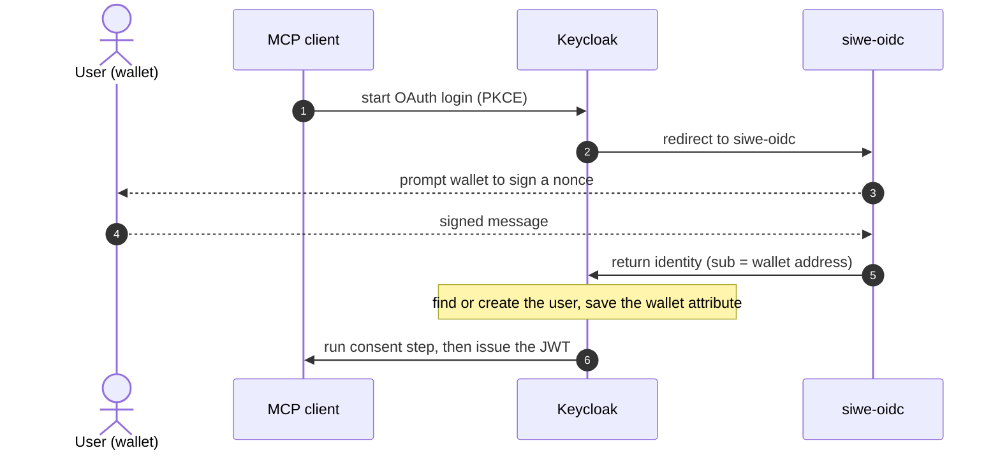
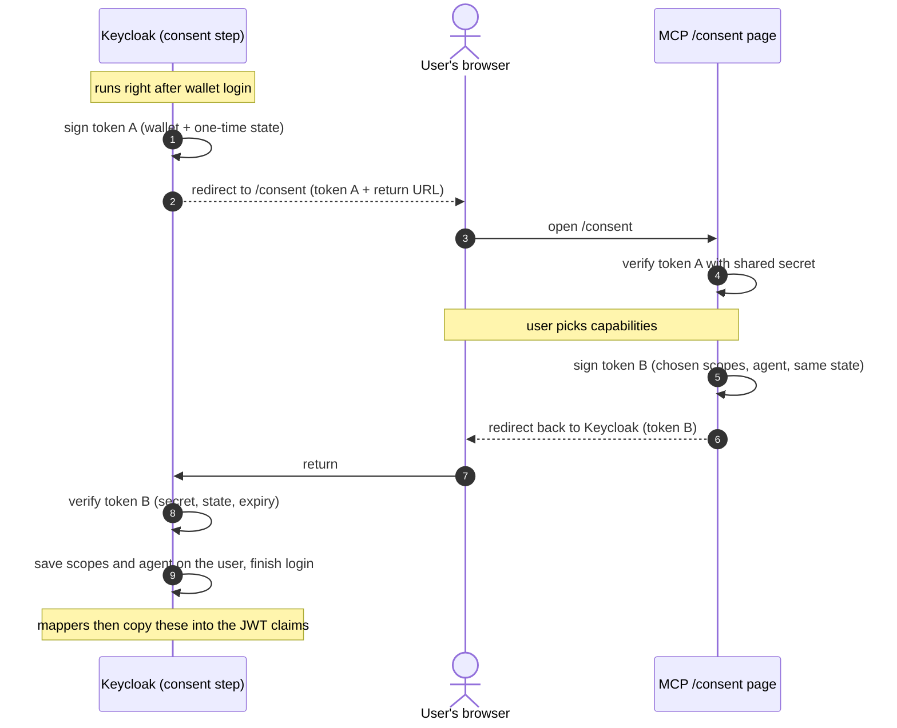

# SIWE ↔ Keycloak

Wallet-based login for the MCP server: users authenticate with an Ethereum wallet, **Keycloak** is the
OAuth authorization server, and **Sign-In with Ethereum** is brokered in behind it. This page documents
that link - the design, the flow, and how to reproduce it. It assumes no prior Keycloak or OAuth depth;
terms link to their specs on first use.

## In one paragraph

Keycloak is our authorization server: it runs login and issues the JWTs our API trusts. It cannot verify
a wallet signature itself, so we delegate that to **`siwe-oidc`** - a small OIDC provider that wraps SIWE.
Keycloak **brokers** login to it: the user signs a message at `siwe-oidc`, Keycloak trusts the result,
provisions or links a local user, and issues a token. Delegating login to an external provider like this
is called **identity brokering**.

## Terminology

- **OAuth 2.1 / OpenID Connect (OIDC)** - the protocols for delegated login and token issuance; OIDC is
  the identity layer over OAuth. Keycloak implements both.
  → [OIDC Core](https://openid.net/specs/openid-connect-core-1_0.html) ·
  [OAuth 2.1 draft](https://datatracker.ietf.org/doc/html/draft-ietf-oauth-v2-1)
- **Authorization Server (AS)** - issues tokens after authenticating the user. Here: **Keycloak**.
- **Resource Server (RS)** - the API that consumes those tokens; it validates them and never performs
  login. Here: our **MCP server** (a Cloudflare Worker).
- **Realm** - a Keycloak tenant: an isolated set of users, clients, and settings. Ours is `ymax`.
  → [Realms](https://www.keycloak.org/docs/latest/server_admin/#configuring-realms)
- **Identity Provider (IdP) / identity brokering** - an external login source Keycloak delegates to,
  trusting what it returns. We register `siwe-oidc` as an OIDC IdP.
  → [Identity brokering](https://www.keycloak.org/docs/latest/server_admin/#_identity_broker)
- **Sign-In with Ethereum (SIWE)** - [ERC-4361](https://eips.ethereum.org/EIPS/eip-4361): authentication
  by signing a structured message with a wallet, in place of a password. `siwe-oidc` exposes it as OIDC.
  → [login.xyz](https://login.xyz/)
- **JWT / claims** - the token Keycloak issues is a signed [JWT](https://datatracker.ietf.org/doc/html/rfc7519);
  its fields (`sub`, or our `https://ymax.app/wallet`) are **claims**.
- **User attribute / protocol mapper** - a key/value stored on a Keycloak user (e.g. `wallet_address`); a
  **protocol mapper** projects attributes into token claims.
  → [Protocol mappers](https://www.keycloak.org/docs/latest/server_admin/#_protocol-mappers)

## The login flow



## Setup

The steps below stand the login up end-to-end. For exhaustive deploy detail (Sevalla CLI commands, the
MCP server, Dynamic Client Registration) see the runbook [`keycloak-setup.md`](./keycloak-setup.md).

### 1. Deploy `siwe-oidc`

`siwe-oidc` performs the wallet check and exposes it as a standard OIDC provider. Deploy it to a public
HTTPS URL - we run [`spruceid/siwe-oidc`](https://github.com/spruceid/siwe-oidc) on Sevalla (see
[`../siwe-oidc/README.md`](../siwe-oidc/README.md)). As an OIDC provider it exposes a fixed endpoint set -
`/authorize`, `/token`, `/userinfo`, `/jwk`, and discovery at `/.well-known/openid-configuration`. Record
its base URL; Keycloak references it.
→ [OIDC discovery](https://openid.net/specs/openid-connect-discovery-1_0.html)

### 2. Deploy Keycloak (container + Postgres)

Keycloak runs as a container backed by Postgres (its store for realms, users, and clients). Our image
([`../keycloak/Dockerfile`](../keycloak/Dockerfile)) bakes in the realm export and the custom consent
authenticator and boots `start --optimized --import-realm`. On Sevalla:

1. Provision **Postgres**.
2. Create an **app** from `keycloak/Dockerfile` (build context `keycloak`), port **8080**.
3. **Link the app to the database.** Sevalla gates app→DB traffic behind an explicit connection; without
   it the JDBC connection hangs.
4. Set the key environment variables:
   - `KC_DB_URL=jdbc:postgresql://<db-host>:5432/keycloak?sslmode=disable`, `KC_DB_USERNAME`, `KC_DB_PASSWORD`
   - `KC_HOSTNAME=https://<public-url>` - must be exact; it determines the token `iss`, which the RS checks
   - `KC_PROXY_HEADERS=xforwarded`, `KC_HTTP_ENABLED=true` (TLS terminates at Sevalla's proxy)
   - `KC_BOOTSTRAP_ADMIN_USERNAME` / `KC_BOOTSTRAP_ADMIN_PASSWORD` (first admin login)
5. Deploy, set `KC_HOSTNAME` to the assigned URL, redeploy.

Confirm it is serving:

```bash
curl -s https://<kc-host>/realms/ymax/.well-known/openid-configuration | jq .issuer
```

→ [Containers](https://www.keycloak.org/server/containers) ·
[Database](https://www.keycloak.org/server/db) ·
[Hostname](https://www.keycloak.org/server/hostname) ·
[Production config](https://www.keycloak.org/server/configuration-production) ·
exact commands in [`keycloak-setup.md` Step 3](./keycloak-setup.md#step-3--deploy-keycloak-on-sevalla)

### 3. Create the `ymax` realm via import

The realm is not created by hand. The image ships
[`../keycloak/realm-export.json`](../keycloak/realm-export.json) and boots with `--import-realm`, so first
boot materializes the `ymax` realm from that file - including, pre-configured:

- the **`siwe-oidc` IdP** (endpoints and issuer set - step 4),
- its **attribute importer** (`sub → wallet_address` - step 6), and
- the `ymax-portfolio` client scope and its token mappers.

Import is skipped if the realm already exists, so subsequent console changes survive redeploys. To
re-apply an edited export, drop and recreate the database.
→ [Importing a realm](https://www.keycloak.org/server/importExport)

### 4. The `siwe-oidc` identity provider

The realm import creates this; it is the entry that delegates login to `siwe-oidc`. In the console it
lives under **Identity providers → siwe-oidc** (type **OpenID Connect v1.0**). The fields that matter:

- **alias** `siwe-oidc` - its internal name, and part of the broker callback `…/broker/siwe-oidc/endpoint`.
- **endpoints + issuer** from step 1 - where Keycloak drives the browser (`authorizationUrl`), exchanges
  the code (`tokenUrl`), reads the profile (`userInfoUrl`), and verifies signatures (`jwksUrl` / `issuer`).

```jsonc
// keycloak/realm-export.json
"identityProviders": [{
  "alias": "siwe-oidc",
  "providerId": "oidc",                        // "OpenID Connect v1.0"
  "config": {
    "clientId": "REPLACE-siwe-client-id",      // set in step 5
    "clientSecret": "REPLACE-siwe-client-secret",
    "authorizationUrl": "https://siwe-oidc-…/authorize",
    "tokenUrl":         "https://siwe-oidc-…/token",
    "userInfoUrl":      "https://siwe-oidc-…/userinfo",
    "jwksUrl":          "https://siwe-oidc-…/jwk",
    "issuer":           "https://siwe-oidc-…/"
  }
}]
```

→ [OIDC identity providers](https://www.keycloak.org/docs/latest/server_admin/#_general-idp-config)

### 5. Register Keycloak as a client on `siwe-oidc`

To use `siwe-oidc`, Keycloak must present a registered `client_id` / `client_secret` - the same
relationship an app has when it registers "Sign in with Google." Register the client on `siwe-oidc` with
Keycloak's broker callback as the redirect URI:

```
https://<kc-host>/realms/ymax/broker/siwe-oidc/endpoint
```

Set the returned credentials into the IdP's two `REPLACE-…` fields from step 4.
→ [OAuth clients and redirect URIs](https://datatracker.ietf.org/doc/html/rfc6749#section-2)

### 6. Import the wallet: `sub` → `wallet_address`

`siwe-oidc` returns the wallet as the token's `sub` (`eip155:1:0x…`). Keycloak, however, assigns its own
generated UUID as the local user's `sub`, so the wallet would otherwise be lost after brokering. An
**Identity Provider Mapper** (type _Attribute Importer_, shipped in the realm export) copies the incoming
`sub` into a `wallet_address` user attribute; a protocol mapper then projects it into the token as
`https://ymax.app/wallet`. This is why the wallet travels as a custom claim rather than `sub`.
→ [Mapping claims and assertions](https://www.keycloak.org/docs/latest/server_admin/#_mappers)

### 7. Auto-redirect to the wallet (optional)

By default Keycloak renders its own login page with a "Sign-In with Ethereum" button. To bypass it and
send users straight to the wallet, set the browser flow's **Identity Provider Redirector** to
`defaultProvider = siwe-oidc`; authorization requests then redirect directly to `siwe-oidc`.
→ [Authentication flows](https://www.keycloak.org/docs/latest/server_admin/#_authentication-flows)

## The consent screen

After brokered login we present our own consent screen - the MCP server's `/consent` page - for the user
to grant portfolio capabilities (e.g. `portfolio:positions`, `portfolio:rebalance`). This is deliberately
**not** Keycloak's built-in consent page (that is disabled); it is an external page connected to Keycloak
by a custom **Authenticator SPI** provider, `ymax-consent-redirect`
([`../keycloak/authenticator/`](../keycloak/authenticator/)). The provider runs as one step in a login
flow, challenging by redirecting the browser to the consent page and resuming when it returns.
→ [Authenticator SPI / Server Developer Guide](https://www.keycloak.org/docs/latest/server_development/#_auth_spi)

### Wiring

- **Placement:** the siwe IdP's **Post-Broker-Login flow** (`ymax-post-broker`), which runs after a
  brokered login with the user already established - not the browser flow (see _Design notes_).
  → [Authentication flows](https://www.keycloak.org/docs/latest/server_admin/#_authentication-flows) ·
  [Post-broker login](https://www.keycloak.org/docs/latest/server_admin/#_after_first_broker_login)
- **Address:** the authenticator's per-step `consentUrl` config property (`https://<worker>/consent`).
- **Trust:** a shared HS256 secret. Keycloak's `KC_SPI_AUTHENTICATOR_YMAX_CONSENT_REDIRECT_SECRET` must
  equal the Worker's `CONSENT_SECRET`. It is read as an SPI option, not a per-step config field, so it is
  not exposed in the admin console.
  → [SPI configuration](https://www.keycloak.org/server/configuration)

The exchange is a signed browser round-trip - no server-to-server call. Everything transits the user's
browser, so each leg is signed and bound to the current login:



1. `authenticate()` mints a short-lived HS256 JWT (`session_token`) carrying the wallet and a single-use
   `state` nonce (persisted on the auth session), then 302s to `consentUrl` with a `redirect_uri` that
   re-enters this step.
2. The `/consent` page ([`../src/consent.ts`](../src/consent.ts)) verifies `session_token`, renders the
   picker, and on submit signs a reply JWT (`scopes`, `agent`, echoing `state`) and redirects back.
3. `action()` verifies the reply's signature, `state`, and expiry, writes `ymax_scopes` / `ymax_agent` as
   user attributes, and completes login. Protocol mappers then project them into
   `https://ymax.app/{scopes,agent}`.

### Design notes

- **Ship the authenticator as a provider jar.** It is compiled and placed in Keycloak's `providers/`
  directory; the [`../keycloak/Dockerfile`](../keycloak/Dockerfile) bundles it and `kc.sh build`
  registers it into the optimized image.
  → [Configuring providers](https://www.keycloak.org/server/configuration-provider)
- **Shade the JWT library.** The authenticator uses [Nimbus JOSE + JWT](https://connect2id.com/products/nimbus-jose-jwt)
  for HS256, which Keycloak does not expose to a provider's classloader - a plain dependency yields
  `NoClassDefFoundError` at runtime. The build shades Nimbus into the jar with package relocation
  (`app.ymax.shaded.*`), isolating it from any server-side copy.
  → [Shade relocation](https://maven.apache.org/plugins/maven-shade-plugin/examples/class-relocation.html)
- **Post-broker flow, not the browser flow.** Keycloak evaluates a flow level such that _an ALTERNATIVE
  step cannot execute alongside a REQUIRED one._ A REQUIRED consent step in the browser flow therefore
  disabled every (ALTERNATIVE) login method. An isolated REQUIRED step in its own post-broker flow avoids
  the conflict.
  → [Execution requirements](https://www.keycloak.org/docs/latest/server_admin/#_execution-requirements)
- **Unmanaged user attributes.** Keycloak's user profile rejects undeclared attributes by default; we
  enable unmanaged attributes so the authenticator can persist `ymax_scopes` / `ymax_agent`.
  → [User profile](https://www.keycloak.org/docs/latest/server_admin/#_understanding-default-user-profile-configuration)
- **Secret length.** HS256 requires a 256-bit key, so the shared secret is ≥ 32 bytes and identical on
  both sides.

## Related

- [`keycloak-setup.md`](./keycloak-setup.md) - the full deployment runbook (MCP server, DCR, tokens, commands).
- [`design-authn-authz.md`](./design-authn-authz.md) - the design rationale and alternatives considered.
